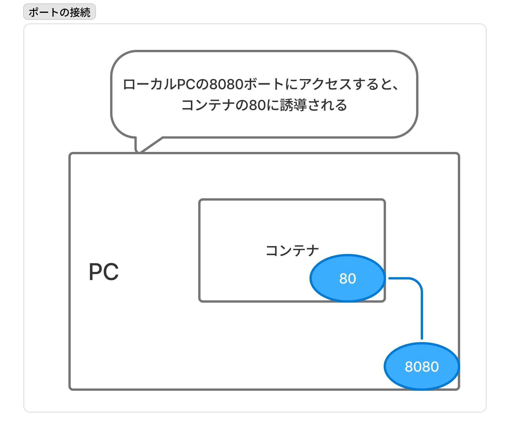

# Dockerゼミ #2 Docker&Kubernetesのきほんのきほん 4~5

## 目次

- [Dockerゼミ #2 Docker\&Kubernetesのきほんのきほん 4~5](#dockerゼミ-2-dockerkubernetesのきほんのきほん-45)
  - [目次](#目次)
  - [4章 - Dockerにコンテナを入れて動かしてみよう](#4章---dockerにコンテナを入れて動かしてみよう)
    - [4.1節 - Docker Engineの起動と終了](#41節---docker-engineの起動と終了)
    - [4.2節 - コンテナ操作の基本](#42節---コンテナ操作の基本)
      - [Dockerコマンドの構造](#dockerコマンドの構造)
      - [主要コマンド](#主要コマンド)
      - [ハンズオン(4.2)](#ハンズオン42)
    - [4.3節 - コンテナの作成・削除と起動・停止](#43節---コンテナの作成削除と起動停止)
      - [docker run](#docker-run)
      - [docker stop](#docker-stop)
      - [docker rm](#docker-rm)
      - [docker ps](#docker-ps)
      - [ハンズオン(4.3)](#ハンズオン43)
    - [4.4節 - コンテナと通信](#44節---コンテナと通信)
      - [ポート](#ポート)
      - [ハンズオン(4.4)](#ハンズオン44)
    - [4.5節 - コンテナ作成に慣れよう](#45節---コンテナ作成に慣れよう)
      - [Linux OS](#linux-os)
      - [Webサーバー](#webサーバー)
      - [Databaseサーバー](#databaseサーバー)
      - [プログラム言語実行環境](#プログラム言語実行環境)
      - [ハンズオン(4.5)](#ハンズオン45)
    - [4.6節 - イメージの削除](#46節---イメージの削除)
  - [5章 - Dockerに複数のコンテナを入れて動かしてみよう](#5章---dockerに複数のコンテナを入れて動かしてみよう)
    - [5.1節 - WordPressの構築と導入の流れ](#51節---wordpressの構築と導入の流れ)
      - [WordPress](#wordpress)
      - [Dockerネットワーク](#dockerネットワーク)
      - [WordPress実行コンテナ群](#wordpress実行コンテナ群)
    - [5.2節 - WordPressコンテナとMySQLコンテナを作成し、動かしてみよう](#52節---wordpressコンテナとmysqlコンテナを作成し動かしてみよう)
    - [5.3節 - コマンド文を書けるようになろう](#53節---コマンド文を書けるようになろう)
      - [LAMP環境](#lamp環境)
    - [5.4節 - RedmineコンテナとMariaDBコンテナを作成し、練習してみよう](#54節---redmineコンテナとmariadbコンテナを作成し練習してみよう)
      - [Redmine](#redmine)
      - [MariaDB](#mariadb)
      - [ハンズオン(5.4)](#ハンズオン54)
  - [コメント・メモ](#コメントメモ)

---

## 4章 - Dockerにコンテナを入れて動かしてみよう

### 4.1節 - Docker Engineの起動と終了

インストールしたDocker Engineは基本的に24/7で動き続け、dockerコマンドを待機している（PCがシャットダウンされればDocker Engineも終了する）。

このDocker Engineの起動方法と（手動による）停止方法は

| OS | 起動方法 | 停止方法 |
| --- | --- | --- |
| Windows, Mac | Docker Desktopを起動 | `Quit Docker Desktop`を選択 |
| Linux | `sudo systemctl start docker`コマンドを実行 | `sudo systemctl stop docker`コマンドを実行 |

また、PCの起動をトリガーに自動でDocker Engineを起動するようにしておく設定も可能で、WindowsとMacではDocker Desktopの

```markdown
設定 -> General -> Start Docker Desktop when you log in
```

で切り替え可能。Linuxでは

```ubuntu
sudo systemctl enable docker
```

のコマンドで設定可能。

※**Docker Engineは自動起動の設定が可能だが、コンテナは自動起動するような設定はできない**ので、コンテナ自動起動のためにはスクリプトなどを用意する必要がある。

### 4.2節 - コンテナ操作の基本

ここではコンテナ操作を行うための主要コマンドを見ていく。
「Dockerコマンドの構造」を解説したのちに、「主要コマンド」を列挙する。

#### Dockerコマンドの構造

Dockerコマンドの構造は以下の通りである

```docker
# 概念系
docker コマンド　(オプション) 対象 (引数)
# 詳細
docker ${top-level solo commands} ${Sub-command} (${options}) ${対象} (${arguments})
# Ex
docker container run -d ${containername}
```

- コマンド
  コマンドは上位コマンド(`top-level solo commands`)と副コマンド(`Sub-command`)に分かれる。**実用上は上位コマンドを除いた省略形のコマンド（これは昔のコマンド）を用いることが多いが、今後この省略コマンドが廃止されるかのうせいがあるため、上位コマンドが存在することは知っておくべき**。
- オプション
  オプションは必ずしも必要ではなく、`-`か`--`がついたオプションを以下のように指定する。

  ```docker
  # パターン1: -
  -d
  # パターン2: --
  --all
  # パターン3: オプションに値を指定する
  --name ${name}
  # パターン4: -と1文字のオプションをまとめる
  -dit
  ```

- 対象
  対象にはコマンドを実行したい対象の名前やIDを指定する。
  例えば、コンテナ名・イメージ名・ボリューム名など
- 引数
  引数は必ずしも必要ではなく、`-`か`--`から始まることが多い。
  文字コードの指定やポート番号の指定に用いる。

#### 主要コマンド

主要コマンドを上位コマンドごとに分けて列挙する。オプションについては説明しないが、以降のハンズオンで触れる。

- コンテナ操作系
  
  ```docker
  docker container ${Sub-command} ...
  ```

  | 副コマンド | 内容 | 省略 | 主なオプション |
  | --- | --- | --- | --- |
  | start | 停止しているコンテナを起動 | OK | -i |
  | stop | コンテナを停止 | OK | . |
  | create | イメージからコンテナを作成 | OK | --name -e -p -v |
  | run | （必要なら）イメージをダウンロードし、コンテナ作成と起動を行う | OK | --name -e -p -v -d -i -t |
  | rm | 停止したコンテナ削除 | OK | -f -v |
  | exec | 実行中のコンテナ内でプログラムを実行 | OK | -i -t |
  | ls | コンテナ一覧を表示 | OK(`ps`) | -a |
  | cp | コンテナとホスト間でファイルをコピー | OK | . |
  | commit | コンテナをイメージに変換 | OK | . |

- イメージ操作系
  
  ```docker
  docker image ${Sub-command} ...
  ```

  | 副コマンド | 内容 | 省略 | 主なオプション |
  | --- | --- | --- | --- |
  | pull | Docker Hubなどのリポジトリからイメージをダウンロード | OK | . |
  | rm | イメージを削除 | OK(`rmi`) | . |
  | ls | ダウンロードしたイメージ一覧を表示 | NG? `images`で見れる | . |
  | build | イメージを作成 | OK | -t |

- ボリューム操作系
  ボリュームとは、コンテナからマウントできるストレージのこと。

  ```docker
  docker volume ${Sub-command} ...
  ```

  | 副コマンド | 内容 | 省略 | 主なオプション |
  | --- | --- | --- | --- |
  | create | ボリュームを作成 | NG | --name |
  | inspect | ボリュームの詳細情報を表示 | NG | . |
  | ls | ボリュームの一覧を表示 | NG | -a |
  | prune | 現在マウントされていないボリュームを全て削除 | NG | . |
  | rm | 指定したボリュームを削除 | NG | . |

- ネットワーク操作系
  Dockerネットワークとは、Docker同士が接続するのに使う仮想的なネットワークのこと。

  ```docker
  docker network ${Sub-command} ...
  ```

  | 副コマンド | 内容 | 省略 | 主なオプション |
  | --- | --- | --- | --- |
  | connect | コンテナをネットワークに接続 | NG | . |
  | disconnect | コンテナをネットワークから切断 | NG | . |
  | create | ネットワークを作る | NG | . |
  | inspect | ネットワークの詳細情報を見る | NG | . |
  | ls | ネットワークの一覧を表示 | NG | . |
  | prune | 現在コンテナがつながっていないネットワークを全て削除 | NG | . |
  | rm | 指定したネットワークを削除 | NG | . |

このように主要なコマンドは`container`, `image`, `volume`, `network`の4つの上位コマンドに分類される。これ以外の上位コマンドは

| 上位コマンド | 内容 |
| --- | --- |
| checkpoint | 現状を一時的に保存し、後でその時点に戻すことができる |
| node | Docker Swarmのノード管理 |
| plugin | プラグイン管理 |
| secret | Docker Swarmのシークレット情報管理 |
| service | Docker Swarmのサービス管理 |
| stack | Docker SwarmやKubernetesでサービスをひとまとめにしたスタックを管理 |
| swarm | Docker Swarmの管理 |
| system | Docker Engineの情報取得 |

などがあるが、まだ使う機会は少ない。Docker SwarmとはKubernetesと異なるオーケストレーション機能のこと。

例外となる単独コマンド（上位コマンドと副コマンドに分かれないもの）がいくつか存在する。

| 単独コマンド | 内容 | 主なオプション |
| --- | --- | --- |
| login | Dockerレジストリにログイン | -u -p |
| logout | Dockerレジストリからログアウト | . |
| search | Dockerレジストリで検索 | . |
| version | Docker Engineやコマンドのバージョンを表示 | . |

#### ハンズオン(4.2)

```docker
# dockerのバージョン表示
docker version
```

### 4.3節 - コンテナの作成・削除と起動・停止

コンテナのライフサイクルは「作成」「起動」「停止」「破棄」である。
このライフサイクルを達成するためのコマンドを詳細に見ていく。
※コンテナを削除するには、事前に停止している必要がある。

#### docker run

`docker run`コマンドは`docker image pull`, `docker create`, `docker start`がひとまとめになったコマンドで、以下のようにコンテナを作成するためのイメージを対象に指定する。

```docker
docker run ${image}
docker container run ${image}
```

指定する主なオプションは

| オプション | 内容 |
| --- | --- |
| `--name ${コンテナ名}` | 作成するコンテナ名を指定 |
| `-p ${ホストのポート番号}:${コンテナのポート番号}`, `-publish ${ホストのポート番号}:${コンテナのポート番号}` | ポート番号を指定 |
| `-v ${ホストのディスク}:${コンテナのディレクトリ}`, `-volume ${ホストのディスク}:${コンテナのディレクトリ}` | ボリュームをマウント |
| `--net=${ネットワーク名}` | コンテナをネットワークに接続 |
| `-e ${環境変数名}=${値}`, `--env ${環境変数名}=${値}` | 環境変数を指定 |
| `-d`, `--detach` | デタッチモード（バックグラウンド）でコンテナを実行 |
| `-i`, `--interactive` | コンテナに操作端末（キーボード）を繋ぐ |
| `-t`, `--tty` | 特殊キーを使用可能にする |
| `-help` | 使い方表示 |

`-d`で指定する**バックグラウンド実行とは、起動したコンテナの実行完了を待たずにコマンドラインでコマンド実行が可能になるオプション**であり、一連の処理で実行完了するようなコンテナではこれを指定しないが、「デーモン」ソフトウェアとしてのコンテナは`-dit`を指定することが多い。
**デーモンとはUNIXやLinux上で動くプログラムの内、常に待ち受けして裏で動き続けるプログラム**のことである（mailer deamonなど）。
`-dit`によってデーモンソフトウェア実行と並行してコンテナ内に入って、キーボードでコマンド実行が可能になる。

#### docker stop

`docker stop`コマンドはコンテナを停止するコマンドで、以下のように停止するコンテナを指定する。

```docker
docker stop ${コンテナ名}
```

#### docker rm

`docker rm`コマンドはコンテナを削除するコマンドで、以下のように削除するコンテナを指定する。

```docker
docker rm ${コンテナ名}
```

#### docker ps

`docker ps`コマンドは動いているコンテナ一覧を表示するコマンドで、`-a`オプションをつけると停止しているコンテナも含めて存在するコンテナ全ての一覧を表示する。

#### ハンズオン(4.3)

```docker
# Apacheのコンテナをrun
docker run --name apa000ex1 -d httpd

# 起動したコンテナを確認
docker ps

# コンテナを停止
docker stop apa000ex1

# コンテナが停止していることを確認
docker ps
docker ps -a

# コンテナを削除
docker rm apa000ex1

# コンテナが削除されたことを確認
docker ps -a
```

### 4.4節 - コンテナと通信

#### ポート

インターネットなどの外界からコンテナに接続するためにはポート（通信の出入り口）を設定する。

```docker
docker run -p ${host port}:${container port} ${image}
```

によって設定できる。
これは、**コンテナの指定ポートとホストマシンの指定ポートを繋いでいて、外界からホストマシンの指定ポートにアクセスすれば、コンテナの指定ポートに自動でアクセスを中継してくれる**。



#### ハンズオン(4.4)

httpdイメージから作成されるApacheコンテナでは、デフォルトで**80番ポートでアクセスを待機**している。
以下ではApacheコンテナ（webサーバー）を立ててアクセスする。

```docker
# コンテナを起動
docker run --name apa000ex2 -d -p 8080:80 httpd

# 起動したか確認
docker ps

# ブラウザでApacheWebサーバーにリクエスト
http://localhost:8080

# コンテナを停止・削除
docker stop apa000ex2
docker rm apa000ex2
docker ps -a
```

### 4.5節 - コンテナ作成に慣れよう

有名なイメージ（コンテナ）を種類別に列挙する。

#### Linux OS

コンテナ内に入ってコマンドを実行する前提で作られているので

- `-it`オプションでキーボード操作を可能に
- `/bin/bash`などでシェルコマンドを指定

する必要がある。例えば

```docker
# 作成 & 起動 & コンテナ内に入る
docker run -it ubuntu bash

# コンテナから脱出
exit

# コンテナ内に入る（ここは奥が深いので盲信NG）
docker exec -it ${container name} bash
```

有名なLinux OSのコンテナは

| イメージ | コンテナ内容 |
| --- | --- |
| ubuntu | Ubuntu |
| centos | CentOS |
| debian | DebianOS |
| fedora | Fedora |
| busybox | BizyBox |
| alpine | Alpine linux |

#### Webサーバー

webサーバーでは外部からアクセスする必要があるので

- `-p`でポートを接続
- `-d`でバックグラウンド実行

を指定するのがほとんど。

| イメージ | コンテナ内容 |
| --- | --- |
| httpd | Apache |
| nginx | Nginx |

#### Databaseサーバー

Databaseサーバーではパスワードを設定する必要があるので、`-e ${password name}=${password}`でrootパスワードを指定すべき。これでも最小設定（ほかに設定すべき項目がある）。

| イメージ | コンテナ内容 | password名 |
| --- | --- | --- |
| mysql | MySQL | MYSQL_ROOT_PASSWORD |
| postgres | PostgreSQL | POSTGRES_PASSWORD |
| mariadb | MariaDB | MYSQL_ROOT_PASSWORD |

#### プログラム言語実行環境

プログラム実行環境もコンテナで作成することができる。

| イメージ | コンテナ内容 | 実行によく使われるオプションと引数 |
| --- | --- | --- |
| openjdk | Javaの実行環境 | `-d`を指定せず、引数にJavaコマンドなどを指定してツールを実行 |
| python | Pythonの実行環境 | `-d`を指定せず、引数にPythonコマンドなどを指定してツールを実行 |
| php | PHPの実行環境 | Webサーバー入りのものとコマンド入りのものなど、タグで分類分けされている |
| ruby | Rubyの実行環境 | Webサーバー入りのものとコマンド入りのものなど、タグで分類分けされている |
| perl | Perlの実行環境 | `-d`を指定せず、引数にPerlコマンドなどを指定してツールを実行 |
| gcc | C/C++コンパイラ | `-d`を指定せず、引数にgccコマンドなどを指定してツールを実行 |
| node | Node.js | `-d`を指定せず、引数にappコマンドなどを指定してツールを実行 |
| registry | Dockerレジストリ | `-d`と`-p` |
| wordpress | WordPress | `-d`と`-p`。MySQLかMariaDBが必要。接続パスワードは`-e`で指定。 |
| nextcloud | NextCloud | `-d`と`-p` |
| redmine | Redmine | `-d`と`-p`。MySQLかMariaDBが必要。 |

#### ハンズオン(4.5)

nginxコンテナ

```docker
# コンテナ起動
docker run --name nginx000ex6 -d -p 8080:80 nginx

# ブラウザでアクセス
http://localhost:8080

# 停止・破棄
docker stop nginx000ex6
docker rm nginx000ex6
```

MySQLコンテナ

```docker
# コンテナ起動
docker run --name mysql000ex7 -dit -e MYSQL_ROOT_PASSWORD=myrootpass mysql

# 停止・削除
docker stop mysql000ex7
docker rm mysql000ex7
```

### 4.6節 - イメージの削除

コンテナを削除してもイメージは削除されないので、意図的にイメージを削除しなければPCにイメージが溜まり続け、ストレージを圧迫する。

イメージ一覧表示は

```docker
docker image ls
docker images
```

で行い、削除するには`イメージID`を指定するか`イメージ名:TAG`で指定する

```docker
docker image rm ${image}
docker rmi ${image}
# 複数イメージの削除は、スペース区切りでイメージを指定すれば良い
```

---

## 5章 - Dockerに複数のコンテナを入れて動かしてみよう

### 5.1節 - WordPressの構築と導入の流れ

#### WordPress

WordPressとは、Webサイトを作成できるソフトウェアで、WordPressを動かすには

- WordPressのプログラム
- Apache
- PHP実行環境
- database（MySQLかMariaDB）

が必要。
**WordPressの公式イメージで作成されるコンテナは、「WordPressプログラム」「Apache」「PHP実行環境」がまとめて入っている**ため、追加でDBを用意すれば良い。

#### Dockerネットワーク

デフォルトでは2つのコンテナは独立していて、コンテナ間の通信は不可能である。
Dockerネットワークにこの2つのコンテナを所属させることで、コンテナ間通信が可能になる。

Dockerネットワークのコマンドは

```docker
# Dockerネットワークの作成
docker network create ${network name}
# Dockerネットワークの削除
docker network rm ${network name}
```

#### WordPress実行コンテナ群

WordPress実行のコンテナ群を作成するための手順は以下である。

1. Dockerネットワークの作成
2. DBコンテナの起動

   ```docker
   docker run --name ${コンテナ名} -dit --net=${ネットワーク名} 
   -e MYSQL_ROOT_PASSWORD=${MySQLのルートパスワード} 
   -e MYSQL_DATABASE=${データベース（領域）名} 
   -e MYSQL_USER=${MySQLの一般ユーザー名} 
   -e MYSQL_PASSWORD=${MySQL一般ユーザーのパスワード}
   mysql --character-set-server=${文字コード} --collation-server=${照合順序}
   ```

3. WordPressコンテナの起動

   ```docker
   docker run --name ${コンテナ名} -dit --net=${ネットワーク} 
   -p ${ホストのポート}:80 
   -e WORDPRESS_DB_HOST=${DBコンテナ名} 
   -e WORDPRESS_DB_NAME=${データベース（領域）名} 
   -e WORDPRESS_DB_USER=${DBの一般ユーザー名} 
   -e WORDPRESS_DB_PASSWORD=${DB一般ユーザーのパスワード} 
   wordpress
   ```

※MySQLコンテナで指定した引数`--character-set-server`と`--collation-server`はMySQLのコンテナに固有のオプションであり、`UTF8`で設定したければ

```docker
--character-set-server=utf8mb4
--collation-server=utf8mb4_unicode_ci
```

※`-e`で指定するパスワード関係の環境変数はMySQLとWordPressのコンテナで一致させておく必要がある。

### 5.2節 - WordPressコンテナとMySQLコンテナを作成し、動かしてみよう

5.1節で説明した手順を実施するハンズオンを行う。

```docker
# Dockerネットワーク作成
docker network create wordpress000net1

# MySQLコンテナ起動
docker run --name mysql000ex11 ...

# WordPressコンテナ起動
docker run --name wordpress000ex12 ...

# 確認
docker ps

# ブラウザからアクセス
http://localhost:8080

# 停止
docker stop ...

# 破棄

# イメージ削除

# ネットワーク削除
```

### 5.3節 - コマンド文を書けるようになろう

#### LAMP環境

[5-2](#52節---wordpressコンテナとmysqlコンテナを作成し動かしてみよう)で構築した「Webサーバー」「プログラム実行環境」「DB」「Linux」のような環境をLAMP環境という。ソフトウェアで言えば

- Linux
- DB: MySQL, MariaDB, PostgreSQL
- Webサーバー: Apache, Nginx
- プログラム実行環境: PHPなど

これはWebシステムに多い構成である。

### 5.4節 - RedmineコンテナとMariaDBコンテナを作成し、練習してみよう

#### Redmine

Redmineとは、「チケット（誰が何をするのか示したToDo）」を管理するソフトウェア。
利用するには、WordPressと同様にデータベースが必要となる。

Redmineコンテナのデフォルトポート番号は`3000`であり、データベースとの接続のための環境変数は

| 項目 | 環境変数名 |
| --- | --- |
| データベースのコンテナ名 | REDMINE_DB_MYSQL |
| データベース（領域）名 | REDMINE_DB_DATABASE |
| データベースの一般ユーザー名 | REDMINE_DB_USERNAME |
| データベースのパスワード（一般ユーザーパスワード） | REDMINE_DB_PASSWORD |

#### MariaDB

MySQL開発者が開発したDBで、コンテナ作成時に指定するオプションはMySQLと似通っているので注意が必要。

| 項目 | 環境変数名 |
| --- | --- |
| rootパスワード | MYSQL_ROOT_PASSWORD |
| データベース（領域）名 | MYSQL_DATABASE |
| データベースの一般ユーザー名 | MYSQL_USER |
| データベースのパスワード | MYSQL_PASSWORD |

#### ハンズオン(5.4)

RedmineとMariaDBのコンテナを立てる

```docker
# Dockerネットワーク作成
docker network create redmine000net3

# MariaDBコンテナ起動
docker run --name mariadb000ex15 ...

# Redmineコンテナ起動
docker run -dit --name redmine000ex16 ...

# ブラウザでアクセス
http://localhost:8080

# コンテナ停止

# コンテナ削除

# イメージ削除

# ネットワーク削除

# ボリューム削除
```

---

## コメント・メモ
