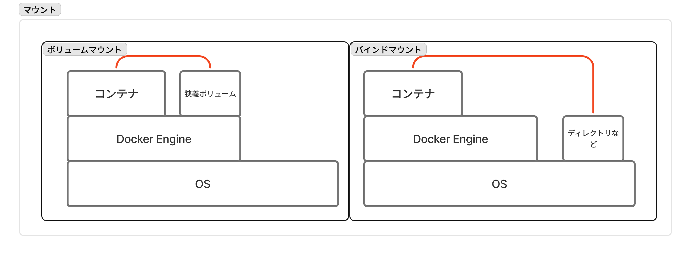
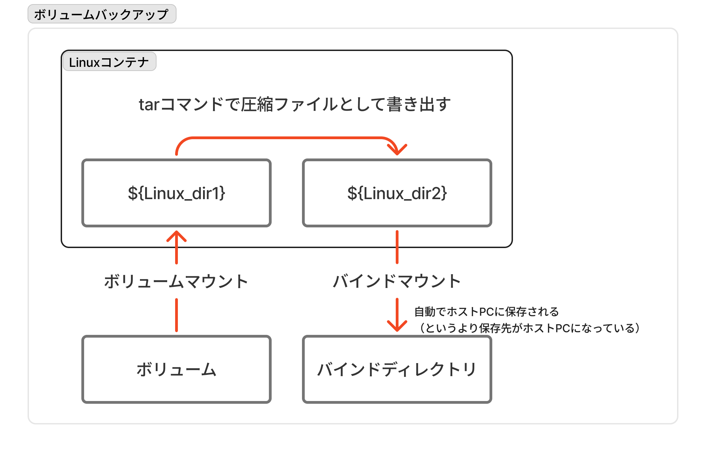

# Dockerゼミ #3 Docker&Kubernetesのきほんのきほん 6

## 目次

- [Dockerゼミ #3 Docker\&Kubernetesのきほんのきほん 6](#dockerゼミ-3-dockerkubernetesのきほんのきほん-6)
  - [目次](#目次)
  - [6章 - 応用的なコンテナの使い方を身につけよう](#6章---応用的なコンテナの使い方を身につけよう)
    - [6.1節　- 自分に必要な技術を整理しよう](#61節--自分に必要な技術を整理しよう)
    - [6.2節 - コンテナとホスト間でファイルをコピーする](#62節---コンテナとホスト間でファイルをコピーする)
      - [概要](#概要)
      - [ハンズオン(6.2)](#ハンズオン62)
    - [6.3節 - ボリュームのマウント](#63節---ボリュームのマウント)
      - [ボリューム](#ボリューム)
      - [マウント](#マウント)
      - [必要性・用途](#必要性用途)
      - [コマンド](#コマンド)
      - [ボリュームのバックアップ](#ボリュームのバックアップ)
      - [ハンズオン(6.3-バインドマウント)](#ハンズオン63-バインドマウント)
      - [ハンズオン(6.3-ボリュームマウント)](#ハンズオン63-ボリュームマウント)
    - [6.4節 - コンテナのイメージ化](#64節---コンテナのイメージ化)
      - [commit](#commit)
      - [Dockerfile](#dockerfile)
      - [ハンズオン(6.4)](#ハンズオン64)
    - [6.5節 - コンテナの改造](#65節---コンテナの改造)
      - [Linuxコマンドの叩き方](#linuxコマンドの叩き方)
      - [Docker Engineとコンテナの管轄領域](#docker-engineとコンテナの管轄領域)
    - [6.6節 - Docker Hubへの登録](#66節---docker-hubへの登録)
      - [Dockerレジストリとレポジトリ](#dockerレジストリとレポジトリ)
      - [タグとアップロード](#タグとアップロード)
      - [レジストリの作成](#レジストリの作成)
  - [コメント・メモ](#コメントメモ)

---

## 6章 - 応用的なコンテナの使い方を身につけよう

### 6.1節　- 自分に必要な技術を整理しよう

Dockerについて、使うことと作ることは全く違う分野であり、作る方が難しい。
作るレベルで習得すべき職種は

- サーバー（インフラ）エンジニア
- セキュリティエンジニア

以降の章で取り扱う内容は

- コンテナとホストPC間のファイルコピー
- ボリュームのマウント（バインドマウントとボリュームマウント）
- コンテナのイメージ化
- コンテナの改造
- Docker Hubへの登録
- Docker Composeによるコンテナの同時起動、環境の大量作成
- Kubernetes（複数台のサーバーでコンテナを動かす際のオケストレーションツール）

### 6.2節 - コンテナとホスト間でファイルをコピーする

#### 概要

コンテナ内のソフトウェアではなく、Dockerコマンドによるコンテナ-ホストPC間でのファイルコピーを見る。コマンドは

```docker
# 汎用
docker cp ${copy_path_from} ${copy_path_to}

# コンテナ Path
${container_name}:${container_path}
```

である。**ホスト側のパスは、絶対パスかカレントディレクトリからの相対パスを指定する**。

※コンテナ内のパスは、先に調べて知っておく必要あり。
※HTMLファイルなどで検証する場合は`index.html`のような初期表示されるファイル名をきちんと指定する必要あり。

#### ハンズオン(6.2)

目標は「Apacheコンテナで任意のHTMLファイルを表示する」こと。

- まずはHTMLファイルを用意

```html
<html>
    <meta charset="utf-8" />
    <body>
        <div>メザシおいしい！</div>
    </body>
</html>
```

- Apacheコンテナを作成

```sh
docker run --name apa000ex19 -d -p 8080:80 httpd
```

- ローカルPCのファイルをコンテナにコピー

```sh
docker cp ${local_file_path} apa000ex19:/usr/local/apache2/htdocs/
```

- ブラウザからコンテナにアクセス

```sh
htttp://localhost:8080
```

### 6.3節 - ボリュームのマウント

#### ボリューム

**ボリュームとは、ストレージの1領域を区切ったもの**。

広義と狭義のボリュームがあり、

- 狭義のボリューム：「ボリュームマウント」で使用するDockerEngineの支配下にある記憶領域。
- 広義のボリューム：コンテナに外付けされる記憶領域総称。狭義のボリューム意外には、ディレクトリ、ファイル、メモリなどがある。

#### マウント

マウント（直訳は「取り付ける」）とは、対象を接続してOSやソフトウェアの支配下に置くことで、パソコンにUSBを差して外付けの記憶領域を持つことに類似する。
**Dockerの文脈でのマウントは、広義のボリュームをコンテナに外付け（マウント）し、データを永続化すること**。

マウントには、「ボリュームマウント」と「バインドマウント」の2種類が存在する。

- ボリュームマウント：Docker Engineが管理する領域にボリュームを作成して、ディスクとしてコンテナにマウントする。推奨されているマウント方法。
- バインドマウント：Docker Engineの管理外のディレクトリやファイル（大体はホストPCのディレクトリと思えば良い）をコンテナにマウントする。



| 項目 | ボリュームマウント | バインドマウント |
| --- | --- | --- |
| 編集 | Dockerコンテナ経由 | 通常のディレクトリと同様 |
| バックアップ | 複雑 | 通常のディレクトリと同様 |
| 利点 | ホストPCの環境に依存しない。手軽。 | ホストPCからの編集・操作が容易 |
| 用途 | 滅多に触らないが消してはいけないデータ | 頻繁に編集するデータ |

※別のマウントとしてtmpfs（一時メモリ）のマウントもあり、利点は高速な読み書きができることで、欠点はホストの再起動で消滅すること。

#### 必要性・用途

コンテナのライフサイクルに則ると、比較的短いスパンでコンテナを削除することになる。この時、コンテナ内のデータも一緒にきえてしまう。
ソフトウェアのバージョンアップで毎回コンテナ内のデータが消えたり、データベースコンテナのデータが消えるのはまずいので、**コンテナの削除によって消えないような、永続化されたデータが欲しい**。

#### コマンド

ボリュームをマウントするには、先にボリュームを作成しておく必要がある（自動で作られるけど非推奨）。

狭義のボリュームの作成・削除コマンドは

```sh
# 作成
docker volume create ${volume_name}

# 削除
docker volume rm ${volume_name}
```

マウントはコンテナの起動（run）時に`-v`オプションで指定する。

```sh
# ボリュームマウント
docker run ... -v ${volume_name}:${container_path}

# バインドマウント
docker run ... -v ${host_pc_path}:${container_path}
```

マウント先のコンテナ内のパスは、コンテナ内ソフトウェアがコンテンツを保存する場所を指定することが多い。
コンテナのどこにどのようなデータが置かれているかは、コンテナイメージのドキュメントで調べる必要がある。

※Apacheでは`/usr/local/apache2/htdocs`、MySQLでは`/var/lib/mysql`。
※コンテナにマウントしているボリュームは`docker container inspect ${container_name}`の`Mounts`プロパティで確かめることができる。

#### ボリュームのバックアップ

バインドマウントするディレクトリはホストPCでコピーをとれば良いだけだが、狭義のボリュームはコンテナ経由でしかボリューム内にアクセスできないので、少し複雑な手順を要する。

具体的には、**ボリュームアクセス専用の一時的なLinuxコンテナを用意して、ボリュームのバックアップ（圧縮ファイル）をホストPCに保存する**。

```sh
# 1. まずはバックアップを取りたいボリュームがマウントしているコンテナを停止
docker stop ${container_name}

# 2. Linuxコンテナに①「バックアップを取りたいボリュームをマウント」
#    ②「バックアップを保存したいディレクトリもバインドマウント」
#.   ③ファイルを圧縮する引数を指定しつつ一時起動
docker run --rm 
  -v ${volume_name}:${Linux_dir1}
  -v ${host_dir}:${Linux_dir2}
  ${Linux_image}
  tar czvf ${Linux_dir2}/${backup_file_name}.tar.gz　-C ${Linux_dir1} .
```

- `--rm`：コンテナを作成してすぐ消す
- `tar czvf ${Linux_dir2}/${backup_file_name}.tar.gz`：ファイル名を指定して新しくgzip形式の圧縮ファイルをマウントしたコンテナ内ディレクトリに作成
  - `c`：createの略で新しいアーカイブを作成するオプション
  - `z`：gzipの略でgzip形式（`.tar.gz`拡張子）で圧縮するオプション
  - `v`：verboseの略で処理中のファイル名を表示するオプション
  - `f`：fileの略で出力ファイル名を指定するオプション
- `-C ${Linux_dir1}`：`tar`コマンドのオプションで作業ディレクトリを`${Linux_dir1}`に設定
- `.`：作業ディレクトリの中の全てを対象とする記述



※リストアコマンドは

```sh
docker run --rm
  -v ${volume_name}:${Linux_dir1}
  -v ${host_dir}:${Linux_dir2}
  ${Linux_image}
  tar xzvf ${Linux_dir2}/${backup_file_name}.tar.gz　-C ${Linux_dir1}
```

#### ハンズオン(6.3-バインドマウント)

目標は「ローカルPCに保存しているHTMLファイルをApacheコンテナで表示する」こと。

- まずはローカルPCにHTMLファイルを用意（[6.2節のハンズオン](#ハンズオン62)で用意した`index.html`を使用する）
- HTMLファイルがあるフォルダをバインドマウントしてApacheコンテナを起動

```sh
docker run --name apa000ex20 -d -p 8080:80 ${path_to_index.html_folder}:/usr/local/apache2/htdocs httpd
```

- ブラウザからコンテナにアクセス

```url
http://localhost:8080
```

#### ハンズオン(6.3-ボリュームマウント)

スキップ。DBでやっても良い。

### 6.4節 - コンテナのイメージ化

特定のコンテナを複製・量産したい場合は、イメージ化してそのイメージからたくさん作れば良い。コンテナのイメージ化には

- commitによってコンテナからイメージを書き出す方法
- Dockerfileからイメージを作成する方法

の2つがある。

#### commit

コンテナを用意して`commit`コマンドを実行することで、現状のコンテナのイメージを書き出す方法。
すでにあるコンテナをイメージ化して複製したい場合に使用する。

使用するコマンドは

```docker
docker commit ${container_name} ${output_image_name}
```

※イメージはそのままではコピーできないので、Dockerレジストリを経由するか`tar`ファイルにして強引にファイル操作できるようにする必要がある。`tar`ファイルにするコマンドは

  ```docker
  docker save -o ${file_name}.tar ${image_name}
  ```

ファイルからイメージにするには`load`コマンドを使用する。

#### Dockerfile

コンテナイメージを作成するコマンドファイルであるDockerfileから、`build`コマンドでイメージを作成する方法。

コンテナ内にファイルなどをコピーしたい場合は、基本的にはそのファイル群と並列になる場所にDockerfileを配置する。プロジェクトにDockerfileが存在するのはこれに則っているため。

使用するコマンドは（`:${tag}`の指定は任意）

```docker
docker build -t ${output_image_name}:${tag} ${dockerfile_dir_path}
# -t はイメージ名を指定するためのオプション
```

Dockerfile内の記述に用いるコマンドは

| コマンド | 内容 |
| --- | --- |
| FROM | 元にするイメージを指定 |
| ADD | イメージにファイルやフォルダを追加（ローカルあるいはリモートからコピー） |
| COPY | イメージにファイルやフォルダを追加（ローカルからコピー） |
| RUN | build時にコマンドを実行 |
| CMD | コンテナ起動時に実行するコマンドを指定 |
| ENTRYPOINT | イメージを実行するコマンドを強要 |
| ONBUILD | build完了時の命令を指定 |
| EXPOSE | 通信を想定するポートをイメージ利用者に伝える |
| VOLUME | 永続データが保存される場所をイメージ利用者に伝える |
| ENV | 環境変数を定義 |
| WORKDIR | RUN,CMD,ENTRYPOINT,ADD,COPY時の作業ディレクトリを指定 |
| SHELL | build時のシェルを指定 |
| LABEL | 名前やバージョン番号、製作者情報などを設定 |
| USER | RUN,CMD,ENTRYPOINTで指定されるコマンドの実行ユーザー・グループを設定 |
| ARG | build時の引数を宣言 |
| STOPSIGNAL | stop時にコンテナで実行しているプログラムに対して送信するシグナルを変更 |
| HEALTHCHECK | ヘルスチェック（コンテナの死活監視）の方法をカスタマイズする |

#### ハンズオン(6.4)

目標は「任意のHTMLファイルを表示するApacheコンテナのイメージを作成する」こと。
具体的には、[6.2節のハンズオン](#ハンズオン62)で用意した`index.html`を表示するApacheコンテナのイメージを、`commit`コマンドと`Dockerfile`の2通りで作成する。

まずは`commit`コマンド。

- [6.2節のハンズオン](#ハンズオン62)と同様に、コンテナにHTMLファイルをコピー
- `commit`コマンドでイメージを作成

```sh
# 作成
docker commit ${container_name} ex22_original1

# 確認
docker images | grep ex22
```

- 新たにコンテナ起動

```sh
docker run --name handson64 -d -p 8080:80 ex22_original1
```

- ブラウザからアクセスして確認

```url
http://localhost:8080
```

次にDockerfile。

- HTMLファイルと同じディレクトリに以下のDockerfileを配置

```dockerfile
FROM httpd
COPY index.html /usr/local/apache2/htdocs/
```

- イメージを作成

```sh
# 作成
docker build -t ex22_original2 ${dockerfile_folder_path}

# 確認
docker images
```

- 必要で絵あればコンテナ起動して確認

### 6.5節 - コンテナの改造

コンテナの改造とは、起動したコンテナに対する追加のカスタマイズのことで

- ファイルのやり取り
- Linuxコマンドによる命令

の2つが主な手法である。ここでは後者の「Linuxコマンドによる命令」を扱う。

#### Linuxコマンドの叩き方

コンテナに対してLinuxコマンドを叩く際に使用するプログラムは`shell`であり、ほとんどのコンテナには`bash`が入っている。このbashに対してコマンドを実行することで、コンテナに対して命令を出すことができる。

bashコマンドを叩くためのコマンドは、dockerコマンドに引数として`/bin/bash`を指定する。bashコマンドを叩き終わったらコンテナから出る必要がある。

```sh
# 起動しているコンテナに、bash命令待機状態で入る
docker exec -it ${containeer_name} /bin/bash

# コンテナから出る
exit

# ↓ これは非推奨
# bashを起動する形でコンテナを作成（Apacheなどの他のソフトウェアは起動しない）
# bash操作後にコンテナを起動する必要あり
docker run ${image} /bin/bash
docker start ${container_name}
```

#### Docker Engineとコンテナの管轄領域

コンテナにbashコマンドを実行する必要が出たことで、dockerコマンドとの棲み分けを知っておく必要がある。

- dockerコマンド：Docker Engineに対する命令
  - Docker Engineの起動・停止
  - コンテナの起動・停止
  - コンテナとファイルのやり取りなど
- bash(sh)コマンド：コンテナ内のbash(sh)に対するコマンド
  - コンテナ内ファイル操作
  - ソフトウェアインストール
  - ソフトウェア実行・停止など

※bashがほとんどなのは、Docker公式が「特に理由がなければDebian系をベースにして」と言っているから。

### 6.6節 - Docker Hubへの登録

`docker run`時にローカルにないイメージはDocker Hubからダウンロードする。
オリジナルのイメージもDocker Hubに置いたり、プライベートなレジストリを作成することもできる。

#### Dockerレジストリとレポジトリ

**Dockerレジストリとはイメージの配布場所**のことで、さまざまなレジストリがこの世に存在する。

- Docker Hub：Docker社公式のレジストリ
- その他：その他、企業や個人の作成したレジストリ

一方でレポジトリはレジストリの中を細かく区切った単位で、基本的にソフトウェア単位で作成される。

#### タグとアップロード

プライベートかどうかに関わらず、レジストリにイメージをアップロードする際はタグをつける必要がある。

タグは所謂イメージの正式名称のようなもので

```sh
${registory}/${repository}:${version}

# Docker Hub
${ID}/${repository}:${version}

# Private Registory
${domain}/${repository}:${version}
```

のように指定する。イメージをアップロードするには以下の手順で行う。

```sh
# 1.イメージにタグ名をつけて複製
docker tag ${image_name} ${registory}/${repository}:${version}

# 2.アップロード（アップロード先はタグ名から勝手に判断される）
docker push ${registory}/${repository}:${version}
```

#### レジストリの作成

プライベートレジストリを作るには、レジストリ用のコンテナを用いる。ポート番号は`5000`を使用する。

```docker
docker run -d -p 5000:5000 registry
```

Docker Hubをレジストリとして使用するには、メールアドレスを登録すれば無料プランで使用できる。
公開設定(public)にしておけば世界中に配布できる。

---

## コメント・メモ
