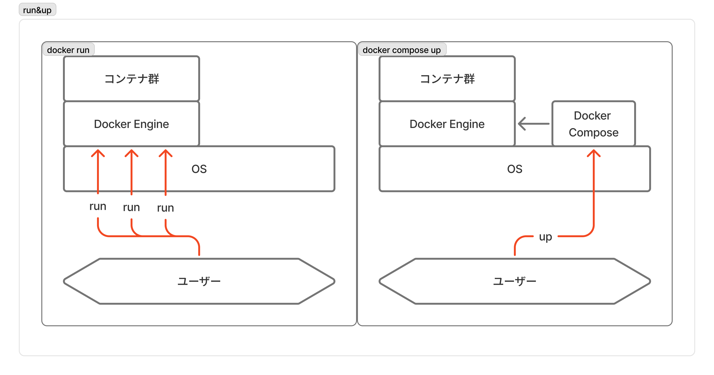
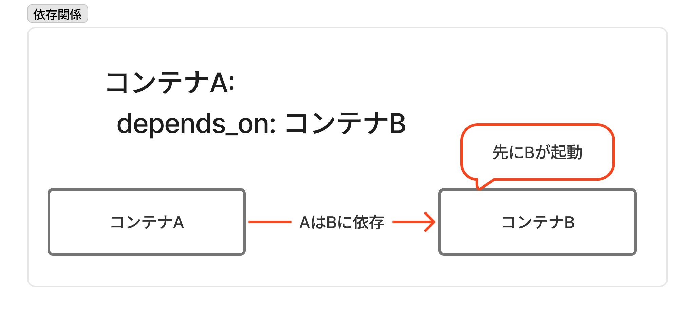

# Dockerゼミ #4 Docker&Kubernetesのきほんのきほん 7

## 目次

- [Dockerゼミ #4 Docker\&Kubernetesのきほんのきほん 7](#dockerゼミ-4-dockerkubernetesのきほんのきほん-7)
  - [目次](#目次)
  - [7章 - Docker Composeについて学ぼう](#7章---docker-composeについて学ぼう)
    - [7.1節　- Docker Composeとは](#71節--docker-composeとは)
      - [Docker Composeとは](#docker-composeとは)
      - [Dockerfileとの違い](#dockerfileとの違い)
    - [7.2節　- Docker Composeの使い方](#72節--docker-composeの使い方)
      - [ディレクトリ構成](#ディレクトリ構成)
      - [命令の描像](#命令の描像)
    - [7.3節 - Docker Composeファイルの書き方](#73節---docker-composeファイルの書き方)
      - [構成](#構成)
      - [設定項目](#設定項目)
      - [Example](#example)
    - [7.4節 - Docker Composeを実行してみる](#74節---docker-composeを実行してみる)
      - [主要コマンド](#主要コマンド)
      - [他のコマンド](#他のコマンド)
      - [ハンズオン](#ハンズオン)
  - [コメント・メモ](#コメントメモ)

---

## 7章 - Docker Composeについて学ぼう

### 7.1節　- Docker Composeとは

#### Docker Composeとは

**Docker Composeとは、ボリュームやネットワークを含めた複数のコンテナ群を一度に実行(up)、停止(down)するためのもの**で、コンテナ群の構築設定は`docker-compose.yml`ファイルに書き込む。

このファイルには

- 各コンテナをrunする時に指定する設定・オプション
- ネットワークの設定
- ボリュームの設定

などが記述される。

Docker Composeにおいて、コンテナの集合体のことを「サービス」と呼ぶ。

#### Dockerfileとの違い

`Dockerfile`はイメージを作成するもの。
一方、`docker-compose.yml`はネットワーク・ボリューム・コンテナを作成するもの。
`docker-compose.yml`を実行するには、コンテナ作成のためにイメージが必要なので、`docker-compse.yml`と`Dockerfile`が共存することもある。

### 7.2節　- Docker Composeの使い方

#### ディレクトリ構成

`docker-compose.yml`ファイルは、（基本的に）このファイル名で作成する。
別名をつける場合は、Docker Composeコマンドを打つ際に引数で明示的に指定する必要がある。

`docker-compose.yml`ファイルは、1つのディレクトリに（基本的に）1つまで。
複数置く場合は、ファイル名を変え、Docker Composeコマンドを打つ際に引数で明示的に指定する必要がある。

#### 命令の描像

`docker run`コマンドで1つ1つコンテナを作成するのと、`docker compose up`コマンドでまとめてコンテナを作成する描像の違いは以下。
Docker Composeが実際にコンテナ作成の命令を出す時に`docker-compose.yml`ファイルを参照する。



### 7.3節 - Docker Composeファイルの書き方

#### 構成

`docker-compose.yml`ファイルは

- services：コンテナ群に関する定義
- networks：ネットワークに関する定義
- volumes：ボリュームに関する定義

のそれぞれについて、以下のように「名前「と「設定」を記述する。

```yml
services:
  ${container_name1}:
    ${settings}
  ${container_name2}:
    ${settings}

networks:
  ${network_name}:

volumes:
  ${volume_name1}:
  ${volume_name2}:
```

設定項目は、設定値が1つの場合と複数の場合で記述方法が異なる。

```yml
# 設定値1つ
${setting}: ${value}

# 設定値1or複数
${setting}:
  - ${value1}
  - ${value2}
```

その他のルールは

- コメントアウトは`#`で記述
- インデントに使用するスペースの数は統一する
- 文字列は`'`か`"`で囲む

#### 設定項目

`docker-compose.yml`ファイルの構成は上で述べたので、以下では設定項目について述べる。

| 項目 | `docker run`コマンドでの対応 | 内容 |
| --- | --- | --- |
| `image` | イメージ引数 | 利用するイメージを指定 |
| `networks` | `--net` | 接続するネットワークを指定 |
| `volumes` | `-v`,`--mount` | 記憶領域のマウントを設定 |
| `ports` | `-p` | ポートのマッピングを設定 |
| `environment` | `-e` | 環境変数を設定する |
| `depends_on` | なし | 別のサービスに依存することを示す |
| `restart` | なし | コンテナが停止した時の再試行ポリシーを設定 |
| `command` | コマンド引数 | 起動時の既定のコマンドを上書きする |
| `container_name` | `--name` | 起動するコンテナ名を明示的に指定 |
| `dns` | `--dns` | カスタムなDNSサーバを明示的に設定 |
| `env_file` | なし | 環境設定情報を書いたファイルを読み込む |
| `entrypoint` | `--entrypoint` | 起動時のENTRYPOINTを上書きする |
| `external_links` | `--link` | 外部リンクを設定 |
| `extra_hosts` | `--add-host` | 外部ホストのIPアドレスを明示的に指定 |
| `logging` | `--log-driver` | ログ出力先を設定 |
| `network_mode` | `--network` | ネットワークモードを設定 |

※バージョンアップによって変更の可能性あり

`depends_on`については、コンテナAの`depends_on`に他のコンテナBを設定した場合、先にコンテナBが起動しその後コンテナAが起動するように設定できる。



`restart`については、コンテナが停止した時の設定で以下

| 設定値 | 内容 | 使用ケース(ref:AI) |
| --- | --- | --- |
| `no` | 何もしない | 単発処理のコンテナ、手動起動の開発中コンテナ |
| `always` | 必ず再起動 | webサーバー、API、DBなど。Docker再起動時に自動起動 |
| `on-failure` | プロセスが0以外のステータスで終了した時は再起動する | 正常終了の場合は再起動不要の場合 |
| `unless-stopped` | 停止していたときは再起動しない。それ以外は再起動 | 本番・常駐サービス。手動でstopしたら再起動しない |

#### Example

5章で作成したWordPressのコンテナ群をDocker Composeで作成するための`docker-comopse.yml`ファイルは

```yml
services:
  mysql000ex11:
    image: mysql
    networks:
      - wordpress000net1
    volumes:
      - mysql000vol11:/var/lib/mysql
    restart: always
    environment:
      MYSQL_ROOT_PASSWORD: myrootpass
      MYSQL_DATABASE: wordpress000db
      MYSQL_USER: wordpress000kun
      MYSQL_PASSWORD: wkunpass
  wordpress000ex12:
    depends_on:
      - mysql000ex11
    image: wordpress
    networks:
      - wordpress000net1
    volumes:
      - wordpress000vol12:/var/www/html
    ports:
      - 8080:80
    restart: always
    environment:
      WORDPRESS_DB_HOST: mysql000ex11
      WORDPRESS_DB_NAME: wordpress000db
      WORDPRESS_DB_USER: wordpress000kun
      WORDPRESS_DB_PASSWORD: wkunpass

networks:
  wordpress000net1:

volumes:
  mysql000vol11:
  wordpress000vol12:
```

### 7.4節 - Docker Composeを実行してみる

#### 主要コマンド

Docker Composeの主要コマンドは、起動(`up`)・停止&破棄(`down`)・停止(`stop`)の3つだけ。

- コンテナを作成し、起動するのための`up`コマンドは

  ```docker
  # compose.ymlファイルパスを指定する場合
  docker compose -f ${file_path} up ${options}

  # カレントディレクトリにdocker-compose.ymlという名前で定義している場合
  docker compose up ${options}
  ```

  主なオプションの項目は

  | オプション | 内容 |
  | --- | --- |
  | `-d` | バックグラウンドで実行 |
  | `--no-color` | 白黒画面として表示 |
  | `--no-deps` | リンクしたサービスを表示しない |
  | `--forec-recreate` | 設定やイメージに変更がなくてもコンテナを再生成する |
  | `--no-create` | コンテナがすでに存在していれば再生性しない |
  | `--no-build` | イメージが見つからなくてもビルドしない |
  | `--build` | コンテナを開始前にイメージをビルドする |
  | `--abort-on-container-exit` | コンテナが1つでも停止したら、全てのコンテナを停止する |
  | `-t`,`--timeout` | コンテナを停止する時のタイムアウト秒数。既定は10秒 |
  | `--remove-orphans` | 定義ファイルで定義されていないサービス用のコンテナを削除 |
  | `--scale` | コンテナの数を変える |

- コンテナとネットワークを停止・削除するための`down`コマンドは

  ```docker
  # compose.ymlファイルパスを指定する場合
  docker compose -f ${file_path} down ${options}

  # カレントディレクトリにdocker-compose.ymlという名前で定義している場合
  docker compose down ${options}
  ```

  ただし、デフォルトではボリュームは削除されない。
  主なオプション項目は

  | オプション | 内容 |
  | --- | --- |
  | `--rmi ${type}` | `${type}`に`all`を指定すると利用した全イメージを削除。`${type}`に`local`を指定するとカスタムタグがないイメージを削除。 |
  | `-v`,`--volumes` | `docker-compose.yml`ファイルの`volumes`に記述されているボリュームを削除。`external`が指定されているものは除く。 |
  | `--remove-orphans` | `docker-compose.yml`ファイルで定義していないサービスのコンテナも削除 |

- コンテナを停止するための`stop`コマンドは

  ```docker
  docker compose -f ${file_path} stop ${options}
  ```

#### 他のコマンド

上で記載した`up`,`down`,`stop`コマンド以外は基本的に使用しないが、以下に説明を載せておく。

| コマンド | 内容 |
| --- | --- |
| `ps` | コンテナ一覧を表示 |
| `config` | `docker-compose.yml`の設定内容の表示 |
| `port` | ポートの割り当てを表示 |
| `logs` | コンテナの出力を表示 |
| `start` | コンテナを開始 |
| `kill` | コンテナを強制終了 |
| `exec` | コマンドを実行 |
| `run` | コンテナを実行 |
| `create` | コンテナを作成 |
| `restart` | コンテナを再起動 |
| `pause` | コンテナを一時停止 |
| `unpause` | コンテナを再開 |
| `rm` | 停止中のコンテナを削除 |
| `build` | コンテナ用のイメージを構築、または再構築 |
| `pull` | コンテナ用のイメージをダウンロード |
| `events` | コンテナからリアルタイムにイベントを受信する |
| `help` | ヘルプ表示 |

#### ハンズオン

- 7.3節のExampleのdocker-compose.ymlファイルを任意の場所に保存
- docker composeコマンドで起動
  
  ```sh
  docker compose -f ${file_path} up -d
  ```

- `http://localhost:8080`にアクセスして確認
- コンテナとネットワークを停止・削除
  
  ```sh
  docker compose -f ${file_path} down
  ```

- volumeを削除
  
  ```sh
  docker volume rm mysql000vol11
  docker volume rm wordpress000vol12
  ```

---

## コメント・メモ
