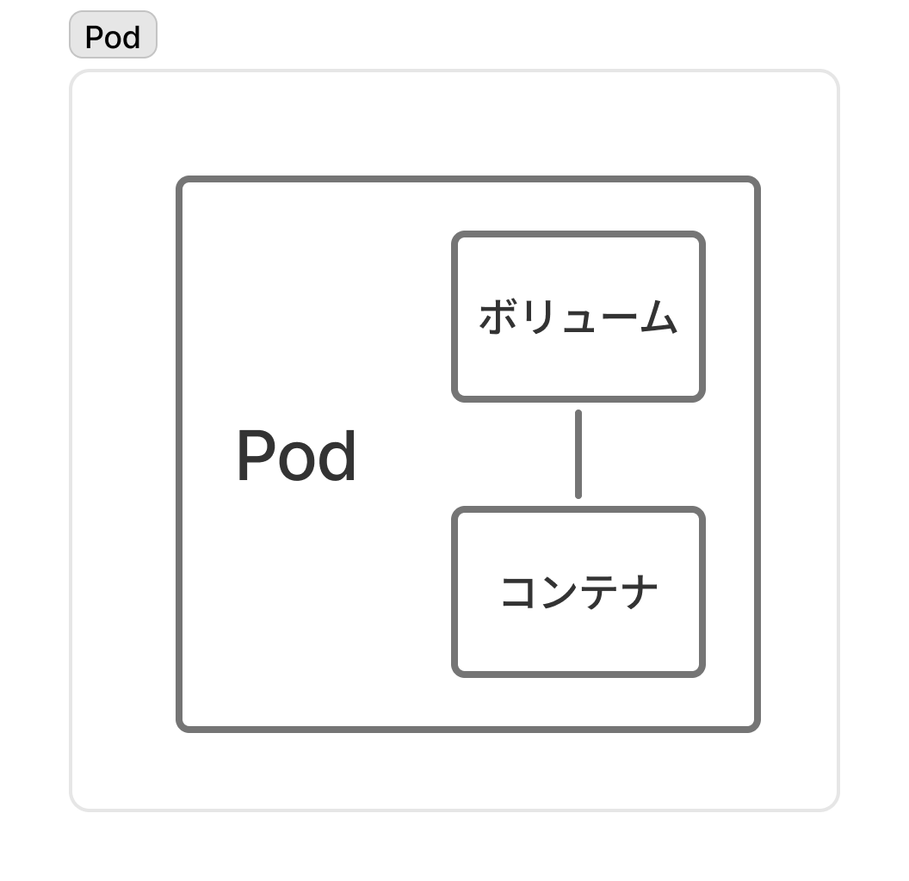
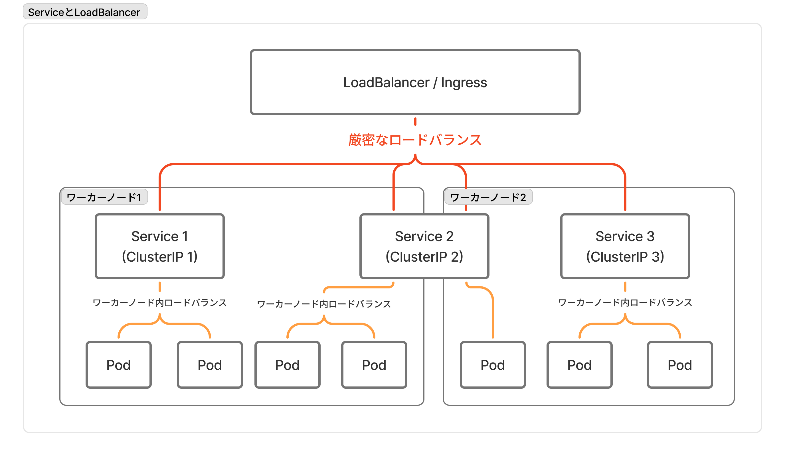
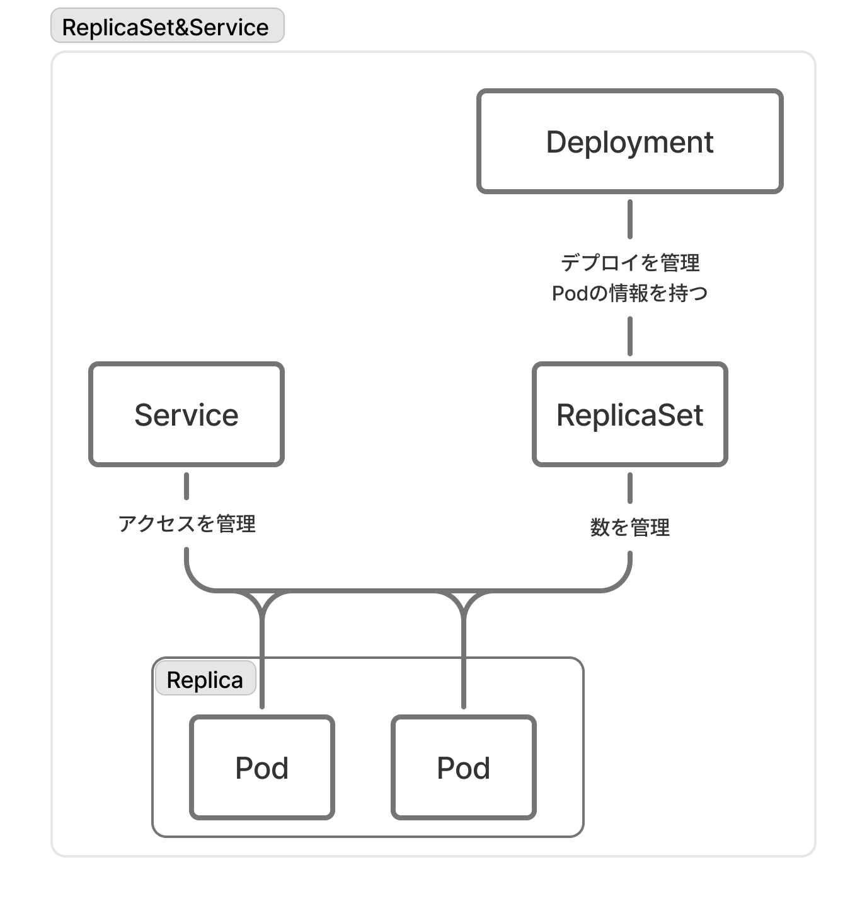
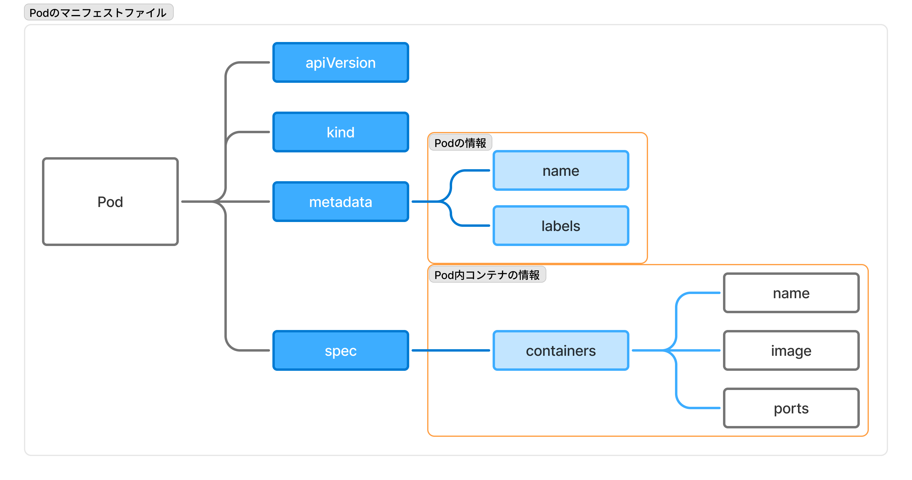
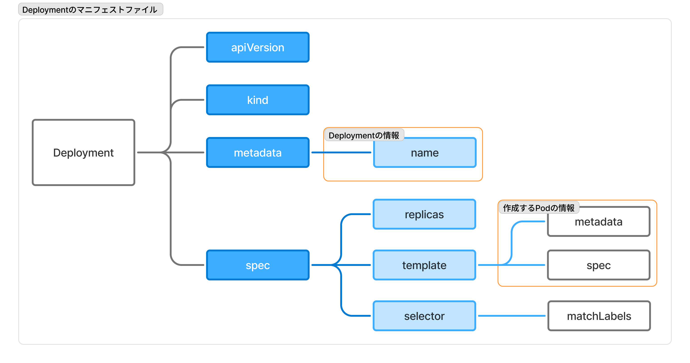
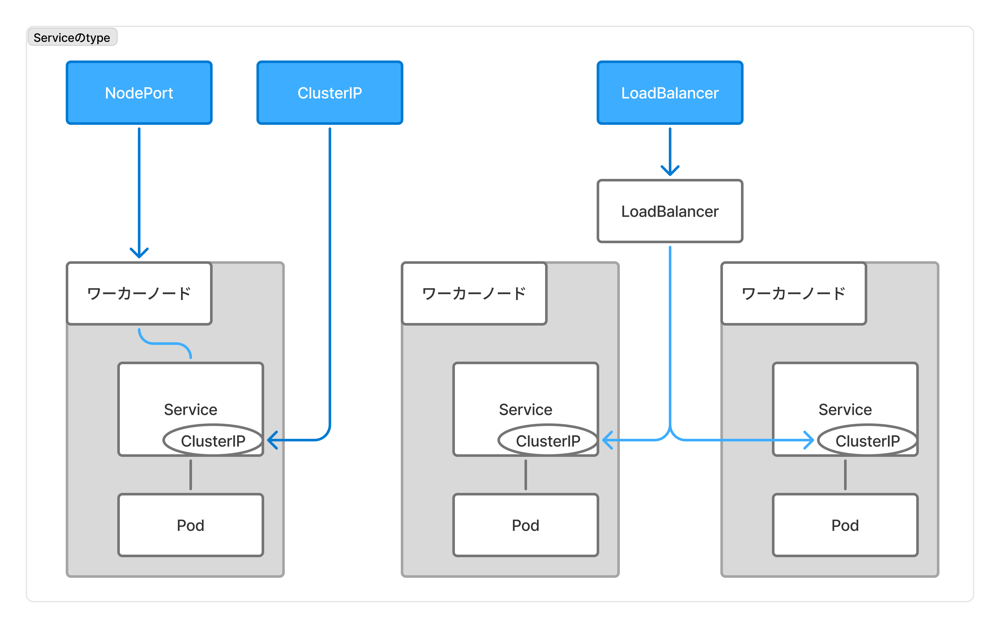

# Dockerゼミ #5 Docker&Kubernetesのきほんのきほん 8

## 目次

- [Dockerゼミ #5 Docker\&Kubernetesのきほんのきほん 8](#dockerゼミ-5-dockerkubernetesのきほんのきほん-8)
  - [目次](#目次)
  - [8章 - Kubernetesについて学ぼう](#8章---kubernetesについて学ぼう)
    - [8.1節　- Kubernetesとは](#81節--kubernetesとは)
    - [8.2節 - マスターノードとワーカーノード](#82節---マスターノードとワーカーノード)
      - [役割分担](#役割分担)
      - [マスターノード](#マスターノード)
      - [ワーカーノード](#ワーカーノード)
      - [インストールするアプリケーション](#インストールするアプリケーション)
      - [状態の維持](#状態の維持)
      - [ロードバランサー](#ロードバランサー)
    - [8.3節 - Kubernetesの構成と用語](#83節---kubernetesの構成と用語)
      - [Pod](#pod)
      - [Service](#service)
      - [ReplicaSet](#replicaset)
      - [Deployment](#deployment)
      - [その他のK8sリソース](#その他のk8sリソース)
    - [8.4節 - Kubernetesのインストールと使い方](#84節---kubernetesのインストールと使い方)
      - [Kubernetesの種類](#kubernetesの種類)
    - [8.5節 - 定義ファイル（マニフェストファイル）の書き方](#85節---定義ファイルマニフェストファイルの書き方)
      - [概要](#概要)
      - [記述内容 / 全体構成・統一部分](#記述内容--全体構成統一部分)
      - [記述内容 / Pod](#記述内容--pod)
      - [記述内容 / Deployment](#記述内容--deployment)
      - [記述内容 / Service](#記述内容--service)
    - [8.6節 - Kubernetesのコマンド](#86節---kubernetesのコマンド)
      - [概要(8.6)](#概要86)
      - [リソースの作成と確認](#リソースの作成と確認)
      - [ハンズオン(8.6)](#ハンズオン86)
    - [8.7節 - Kubernetesの操作を練習しよう](#87節---kubernetesの操作を練習しよう)
      - [定変更](#定変更)
      - [リソースの削除](#リソースの削除)
      - [ハンズオン(8.7)](#ハンズオン87)
  - [コメント・メモ](#コメントメモ)

---

## 8章 - Kubernetesについて学ぼう

### 8.1節　- Kubernetesとは

**Kubernetes(K8s)とは、コンテナのオーケストレーションツール**。
オーケストレーションツールとは、システム全体の統括をして複数コンテナを管理できるもの。

Kubernetesは大規模なシステムで特に有用。
Dockerは物理的（あるいは仮想的）な1台のマシン上で実行してきたが、Kubernetesでは物理的（あるいは仮想的）な複数台のマシンに対して命令・操作を行う。各マシン上に複数のコンテナがある。

つまり、**複数マシン上の大量のコンテナを「いい感じ」に作成・管理してくれるのがKubernetes**。
ここでいう「いい感じ」とは、マニフェストファイル（超大雑把にはdocker-compose.ymlのような定義ファイル）に従って自動でやってくれるという意味。

### 8.2節 - マスターノードとワーカーノード

#### 役割分担

Kubernetesには「マスターノード」と「ワーカーノード」という2種類のノード（物理的なマシンと思っておけば良い）が存在する。
この2つのノードで構成されたKubernetesシステムの一群を「Cluster」と呼ぶ。

- マスターノード：ワーカーノード（あるいはその上のコンテナ）を管理する
- ワーカーノード：実際の機能的なサーバー


#### マスターノード

マスターノードは、ワーカーノード（あるいはその上のコンテナ）を管理するためのもので、マスターノード上でコンテナは動いていない（そのためDocker Engineなどは必要ない）。

ワーカーノードを管理するための、マスターノードの「コントロールプレーン（制御盤）」は、以下の5つのコンポーネントで構成されている。

| 項目 | 内容 |
| --- | --- |
| `kube-apiserver` | 外部とやり取りをするプロセス。kubectlからの命令を受け取って実行。 |
| `kube-controller-manager` | コントローラーを統括管理・実行する |
| `kube-scheduler` | Podをワーカーノードに割り当てる |
| `cloud-controller-manager` | クラウドサービスと連携してサービスを作る |
| `etcd` | クラスター情報を全管理するデータベース |

#### ワーカーノード

ワーカーノードは、実際の機能的なサーバーとなるものであり、ワーカーノード上でコンテナを動かす（動かすコンテナはDockerとは限らない）。

ワーカーノードで使用されるコンポーネント（アプリケーション）は

| 項目 | 内容 |
| --- | --- |
| `kube-let` | マスターノード側の`kube-scheduler`と連携して、ワーカーノード上にPodを配置し実行する。実行中Podの状態を定期的に監視して`kube-scheduler`に通知する |
| `kube-proxy` | ネットワーク通信をルーティングする仕組み |

#### インストールするアプリケーション

Kubernetesはソフトウェアであるため、各マシンにインストールする必要がある。
各マシンとはノードのことであり、1つのマシンにKubernetesをインストールするとマスターノードとワーカーノードができるのではなく、複数のマシンにKubernetesをインストールし、マスターノードやワーカーノードをセットアップしてClusterを構成する。

※AI的には、1台のマシンをマスターノードとワーカーノードに分けることも可能。

インストールするべきソフトウェアの分類は

| ソフトウェア | 対象 | 概要 |
| --- | --- | --- |
| Kubernetes | マスターノード、ワーカーノード | Kubernetesのソフトウェア |
| CNI | マスターノード、ワーカーノード | Container Networking Interfaceの略で、仮想ネットワークのドライバ。flannel,Calico,AWS VPC CNIなど |
| etcd | マスターノード | キーバリュー型のデータベース |
| Container Engine | ワーカーノード | コンテナの実行に必要 |
| kubectl | 管理者（ユーザー）PCなど | コマンドによってkube-apiserverに対して命令を出せる |

※Kubernetesに複数のソフトウェアコンポーネント（kube-apiserverなど）が入っている。

#### 状態の維持

ここでは[8.1節](#81節--kubernetesとは)で述べた

> マシン上の大量のコンテナを「いい感じ」に作成・管理してくれる

について概要を説明する。
KubernetesのDocker（あるいはDocker Compsoe）との大きな違いの1つは、状態の維持である。
Docker Composeは複数コンテナを監視しておらず、まとめて作成して終了であるのに対し、**Kubernetes（というよりマスターノード）はコンテナを監視していて、設定内容と異なる状態になったとしたら自動で元の状態になるように維持**してくれる。

この維持するべき状態を示すのが、マニフェストファイルである。マニフェストファイルの内容が`etcd`に保存され、Kubernetesはそのデータベース上の情報を参照し、その状態に保つ。
※データベースに保存されているため、マニフェストファイルを変更せずにデータベースの値を変更すると、Kubernetesが参照する設定値とマニフェストファイルの内容に差分が生じるので注意

例えば、コンテナの数を4つで設定していた場合

1. 何らかの障害がそのうちの1つのコンテナで発生
2. Kubernetes（というよりマスターノード）が障害が発生したコンテナを削除 & 新たに同じコンテナを作成
3. コンテナ数を4に保つ


#### ロードバランサー

Q：同じコンテナが複数必要なの？？
A：大規模なシステムでは必要。全世界の人がアクセスするようなサービスでは、1つのサーバーではリクエストが多すぎて捌ききれない（サーバーダウンしてユーザーに謝罪する羽目に、、、）。
そのために同じサーバーを用意して、1つのサーバーあたりに来るリクエスト数を減らす。（他にも理由はあるが、、、）

↑ のような複数サーバーを扱う時には「ロードバランサー（負荷分散）」という単語が出てくる。

**ロードバランサーは、受け取る大量リクエストを複数のサーバーに振り分けるもの。**
イメージは、空いたレジに客を案内する人（この場合、サーバーはレジに対応）。

### 8.3節 - Kubernetesの構成と用語

ここではKubernetes独自の代表的なリソース（特定の名前がつけられたもの）である`pod`,`service`,`deployment`,`replicaset`を説明する。

#### Pod

**Podとは、Kubernetesがコンテナを管理するときの単位となるものであり、コンテナとボリュームがセットになったもの**。基本的には1Podに1コンテナである。少し重要なことは、K8sにおける（リソースを割り当てる際の）最小の論理単位。

「コンテナを管理する時の単位」とは、Kubernetesがコンテナを管理する時はPod単位で行われるという意味。
また、ここにおけるボリュームはPodの中の複数のコンテナが情報共有するために使用するもので作らないこともしばしば。



#### Service

**Serviceとは、同一構成のPodをまとめて管理するもの**。Podが複数のワーカーノードにまたがって存在していても、Serviceがまとめて管理できる。

※Serviceは、「Podをまとめて管理する」という機能を指す論理的なリソースであり、実体は存在しない。この機能は`kube-proxy`によって実現されている。
この言い方をすれば、Podも論理的なリソース。実体のある（？）コンテナとボリュームのセットに名前をつけただけ。

**Serviceの機能である「Podをまとめて管理」とは、具体的には「ワーカーノード内のロードバランサー」である。**
各Serviceには固有の`ClusterIP`（いわゆるIPアドレス）が振られ、ServiceはそのClusterIPに来たアクセスを、自分が管理するPodに振り分けることができる。ただし、Serviceが感知するClusterIPへのアクセスはワーカーノードがすでに特定されていて、そのワーカーノード内のPodに振り分ける。

より厳密な（あるいは広い）意味でのロードバランサーとなるのは、`Ingress`（HTTP/HTTPS専用のアプリケーションレイヤーで動作するリバースプロキシ）などである。
これらの厳密なロードバランサーが、アクセスの各ClusterIPへの振り分けやワーカーノードへの振り分けを行う。



#### ReplicaSet

**ReplicaSetとは、Podの数を管理するもの**で、ReplicaSetによって管理されている同一構成のPodを`Replica`と呼ぶ。

障害などでPodが停止した時に、足りない分を増やしたり、マニフェストファイルでの数が変動したらその分を増減させる。

#### Deployment

**Deploymentとは、Podのデプロイ（配置・展開）を管理するもの**で、ReplicaSetと一緒に使用される。
DeploymentはPodの情報を持っていて、ReplicaSetよりも上位にいる。



#### その他のK8sリソース

その他、比較的有名なリソースを記す。

| リソース名 | 内容 |
| --- | --- |
| pods | Pod。コンテナとボリュームのセット。 |
| services | Podへのアクセスを管理 |
| deployments | Podのデプロイを管理 |
| replicasets | Podの数を管理 |
| --- | --- |
| podtemplates | デプロイメントする時のPodの雛形 |
| replicationcontrollers | レプリケーションのコントローラー |
| resourcequotas | Kubernetesのリソース使用量の制限を設定 |
| secrets | 鍵情報を管理 |
| serviceaccounts | 操作するユーザーを管理 |
| daemonsets | ワーカーノードごとに1つのPodを作成 |
| statefulsets | Podのデプロイを状態を保ったまま管理 |
| cronjobs | スケジュールしてPodを実行 |
| jobs | Podを一回実行 |

### 8.4節 - Kubernetesのインストールと使い方

#### Kubernetesの種類

Kubernetesは[CNCF(Cloud Native Computing Foundation)](https://www.cncf.io/)で策定された規格のオープンソースであり、サードパーティ（本家以外）が出しているものも含めて多くの種類が存在する。

CNCFは、コンテナ技術を中心としたインフラに関わる仕組みの発展や連携を支援するために、Google社などが創立した団体。

書籍で特に言及があった種類のKubernetesは

- Docker Desktop
  ローカルPCという1台のマシンにマスターノードとワーカーノードを構築する簡易的なKubernetes。マニフェストファイルやkubeコマンドの練習用。
- minikube
  Linuxでも使用できる簡易的なKubernetes。Docker Desktopが使えないLinuxにおいてKubernetesを練習するのに有用。
- EKS(Amazon Elastic Kubernetes Service)
  AWSのKubernetesサービス。マスターノードに相当する。ワーカーノードはEC2やFargate（コンテナエンジンサービス）を使用し、EKSで管理する。

### 8.5節 - 定義ファイル（マニフェストファイル）の書き方

#### 概要

**マニフェストファイルとは、Kubernetesにおいて自動で保たれる「望ましい状態」の設定が記述されているファイル**のことである。
※実際にKubernetesが参照している設定は、マニフェストファイルからコピーされたデータベース(etcd)上のデータ。

マニフェストファイルについて、基本的な事項を列挙しておく。

- YAML形式（拡張子`.yml`）
- ファイル名は自由
- Kubernetesのリソース単位ごとに記述できる
  1つのファイルにまとめて記述する場合は、リソースごとに`---`で区切る

#### 記述内容 / 全体構成・統一部分

マニフェストファイルはリソースごとにその記述内容が異なるが、ここではどのリソースでも共通しているマニフェストファイルの構成や記述内容を見ていく。

**マニフェストファイルは、`Deployment`や`Service`などリソース単位で設定を記述する。ただし`Pod`と`ReplicaSet`に関しては、`Deployment`の設定の中で設定を記述する**ことがほとんどであり、マニフェストファイルのリソース区分からは除外して記憶するべき。

定義ファイルに記述する大きな項目の4つを以下に記す。これはどのリソースでも共通している。

| 項目 | 内容 |
| --- | --- |
| `apiVersion` | APIグループ（Kubernetes側でつけている機能区分）とそのバージョン |
| `kind` | リソースの種類 |
| `metadate` | メタデータ（リソースを使う側が欲しい情報的な） |
| `spec` | リソースの中身・内容 |

どんなリソースのマニフェストファイルでも必ずこの4つで構成されていて、この中でリソースごとに記述する内容が大きく異なるのは、`metadata`と`spec`である。よって以下ではまず共通している`apiVersion`と`kind`について扱う。

`apiVersion`と`kind`は、リソースごとに指定すべき値が決まっている。ここまでで扱ったリソースについては
※リソースタイプの最新版はkubectlコマンドにapi-resourceを指定して確認できる

| リソース | `apiVersion` | `kind` |
| --- | --- | --- |
| Pod | `core/v1`（`v1`でも可） | `Pod` |
| Service | `core/v1`（`v1`でも可） | `Service` |
| Deployment | `apps/v1` | `Deployment` |
| ReplicaSet | `apps/v1` | `ReplicaSet` |

`metadata`には「リソースの名前」や「ラベル」を記述する。
ラベルは`key:value`のペアであり、セレクター機能で特定のラベルのリソースのみに対して操作できる。

主に設定されるメタデータは

| 項目 | 内容 |
| --- | --- |
| `name` | リソースの名前。一意に識別される文字列。 |
| `namespace` | リソースが細分化されるDNS互換のラベル |
| `uid` | 一意に識別する番号 |
| `resourceVersion` | リソースバージョン |
| `generation` | 生成した順序を示す番号 |
| `creationTimestamp` | 作成日時 |
| `deletionTimestamp` | 削除日時 |
| `labels` | 任意のラベル |
| `anotaiton` | リソースに対して設定したい値。選択対象にはならない |

#### 記述内容 / Pod

`Pod`は基本的には、これ単体でマニフェストファイルに記述することは少なく、`Deployment`の設定の中で間接的に設定するのが通常である。なぜなら、DeploymentがPodの数を保つ機能を有していて、Pod自体にはその機能がないから。
しかし、ここではPod単体で設定する際の記述方法を示しておく。

```yml
metadata:
  name: ${Pod名}
  labels: ${ラベル}
spec:
  containers:
  - name: ${コンテナ名}
    image: ${元にするイメージ}
    ports: ${使用するポート}
```

視覚的な描像は



例えばこんな感じ↓↓↓

```yml
apiVersion: v1
kind: Pod
metadata:
  name: apa000pod
  labels:
    app: apa000kube
spec:
  containers:
    - name: apa000ex91
      image: httpd
      ports:
        - containerPort: 80
```

※`spec`に`volumes`を指定することもできる。ただしここで指定するボリュームは、Pod内のコンテナ間で共有するデータに使用するもので、Podの外からアクセスできるものではない。使用用途は例えば、「ログを書き出すための記憶領域」。

#### 記述内容 / Deployment

`Deployment`は`Pod`を生成するものなので、`spec`内の`template`部分にPodの設定も書いておく必要がある。

```yml
metadata:
  name: ${Deploymant名}
spec:
  selector:
    matchLabels: ${ラベルをセレクタで選択して管理（特定のラベルが付いたPodを管理できる）。template/metadata内で設定したラベルを指定する。}
  replicas: ${レプリカの設定（Podの数を幾つにするか）}
  template: # Podの情報
    metadata: ${Podのmetadata}
    spec: ${Podのspec}
```

視覚的な描像は



例えばこんな感じ↓↓↓

```yml
apiVersion: apps/v1
kind: Deployment
metadata:
  name: apa000dep
spec:
  selector:
    matchLabels:
      app: apa000kube
  replicas: 3
  template:
    metadata:
      labels:
        app: apa000kube
    spec:
      containers:
        - name: apa000ex91
          image: httpd
          ports;
            - containerPort: 80
```

#### 記述内容 / Service

`Service`は`Pod`へのアクセス管理をするもので、マニフェストファイルでも通信に関係する内容を設定する。また、`Deployment`とセットで使用されることが多い。

```yml
metadata:
  name: ${Service名}
spec:
  type: ${Serviceの種類}
  ports: # ポートの設定
    - port: ${Service_port}
      targetPort: ${Container_port}
      protocol: ${通信のプロトコル}
      nodePort: ${ワーカーnode_port}
  selector: # セレクタの設定
```

`type`では、`Service`に対してどのDNS（あるいはIP）でアクセスするかを設定し、具体的に指定できる値は

| type | 内容 | 用途 |
| --- | --- | --- |
| `ClusterIP` | ClusterIPでServiceにアクセスでき、外からアクセス不可 | クラスター内部でやり取りする時に設定 |
| `NodePort` | ワーカーノードのIPでServiceにアクセスできる | ワーカーノードに直接アクセスする時に設定 |
| `LoadBalancer` | ロードバランサーのIPでServiceにアクセスできる | 業務上はほとんどこれ |
| `ExternalName` | PodからServiceを通じて外に出る | Podが外に通信したい場合 |



`ports`はポートの設定で、通信プロトコル`protocol`は通常`TCP`を設定する。また、`NodePort`に設定できる値は`30000~32767`の範囲。

例えばこんな感じ↓↓↓

```yml
apiVersion: v1
kind: Service
metadata:
  name: apa000ser
spec:
  type: NodePort
  ports:
    - port: 8099
      targetPort: 80
      protocol: TCP
      nodePort: 30080
  selector:
    app: apa000kube
```

※Serviceで指定する`selector`は`matchLabels`では指定できずラベルをそのまま指定する。このように書式が違うのは、`Deployment`と`Service`でセレクターの内部処理が異なるから。（多分`Deployment`は条件判定で`Service`は特定指定）

### 8.6節 - Kubernetesのコマンド

#### 概要(8.6)

Kubernetesはkubectlコマンドによって操作する。kubectlコマンドのフォーマットは

```sh
kubectl ${command} ${options}
```

各コマンドとその内容は

| コマンド | 内容 |
| --- | --- |
| `create` | リソースを作成 |
| `edit` | リソースを編集 |
| `delete` | リソースを削除 |
| `get` | リソースの状態を表示 |
| `set` | リソースの値を設定 |
| `apply` | リソースの変更を反映 |
| `describe` | 詳細情報を確認 |
| `diff` | 現在の状態とマニフェストの差を確認 |
| `expose` | リソースを生成するための定義ファイルを作成 |
| `scale` | レプリカ数を変更 |
| `autoscale` | オートスケールを設定 |
| `rollout` | ロールアウトを操作 |
| `exec` | コンテナでコマンドを実行 |
| `run` | コンテナでコマンドを1回実行 |
| `attach` | コンテナにアタッチ |
| `cp` | コンテナにファイルをコピー |
| `logs` | コンテナのログを表示 |
| `cluster-info` | クラスターの詳細を表示 |
| `top` | CPU、メモリ、ストレージのリソースを確認 |

#### リソースの作成と確認

マニフェストファイルをKubernetesに読み込ませて、リソースを作成するには`apply`コマンドを使用する。
この時、`-f`オプションで参照するマニフェストファイルのパスを指定する。

```sh
kubectl apply -f ${manifest_file_path}
```

作成されたリソースの状態を確認するには`get`コマンドを使用する。
`get`に続けてリソースの種類（`pod`や`service`など）を指定する。

```sh
kubectl get ${resource_kind}
```

#### ハンズオン(8.6)

以下はDocker DesktopのKubernetesをONにして実行する。

- 8.5節の`Deployment`のマニフェストファイルを`apply`して`Pod`を作成

```sh
kubectl apply -f ${path_to_apa000dep.yml}
```

- `Pod`が作成されていることを確認

```sh
kubectl get pods
```

- 8.5節の`Service`のマニフェストファイルを`apply`して`Service`を作成

```sh
kubectl apply - ${path_to_apa000ser.yml}
```

- `Service`が作成されていることを確認

```sh
kubectl get services
```

- ブラウザから`Pod`にアクセス

```url
http://localhost:30080
```

※8.7節でハンズオンを続けるのでリソースの削除はしない。

### 8.7節 - Kubernetesの操作を練習しよう

#### 定変更

リソースの設定を変更し、反映させるには

1. マニフェストファイルの値を変更
2. `kubectl apply -f ${manifest_file}`

のように再度適用すれば良い。`Replica`の数を変えたり、イメージを変えたりできる。

#### リソースの削除

リソースの削除をするには`delete`コマンドを使用する。
Kubernetesに登録されている設定は変えないけれども一時的にリソースを削除したければ

```sh
kubectl delete ${resource_kind} ${resource_name}
```

で削除する。これで`Pod`を削除すると、Kubernetesは元の`Pod`の数を保つために新たな`Pod`を生成する。

一方、Kubernetesに登録されている設定自体で削除したければ

```sh
kubectl delete -f ${manifest_file_path}
```

で削除する。

#### ハンズオン(8.7)

まずは、マニフェストファイルの設定値変更を見る。

- `Deployment`のマニフェストファイルにおいて`replicas`の値を`5`にする
- 変更したマニフェストファイルを反映させる

```sh
kubectl apply -f ${path_to_apa000dep.yml}
```

- `Pod`の数が増えていることを確認

```sh
kubectl get pods
```

- `Deployment`のマニフェストファイルにおいて`image`を`nginx`に変える
- 変更したマニフェストファイルを反映する

```sh
kubectl apply -f ${path_to_apa000dep.yml}
```

- ブラウザから`Pod`にアクセスし、イメージが変わっていることを確認（必要に応じてブラウザをリロード）

```url
http://localhost:30080
```

次に、`Pod`削除時の自動生成を見る。

- `Pod`名を確認

```sh
kubectl get pod
```

- `Pod`を指定して削除

```sh
kubectl delete pod ${pod_name}
```

- `Pod`が生まれ変わっていることを確認

```sh
kubectl get pod
```

最後に、リソースを削除する。

- `Deployment`を削除

```sh
kubectl delete -f ${path_to_apa000dep.yml}
```

- `Deployment`が削除されていることを確認

```sh
kubectl get deployment
```

- `Service`を削除

```sh
kubectl delete -f ${path_to_apa000ser.yml}
```

- `Service`が削除されていることを確認

```sh
kubectl get service
```

---

## コメント・メモ

- プロキシとは通信の代理人。クライアントとサーバーの間に入って、匿名で通信できるようにするもの。
  - （フォワード）プロキシはクライアントの代理人。サーバー側はクライアント側が誰かを特定できない。
  - リバースプロキシはサーバーの代理人。クライアント側はサーバー側の詳細を知らない。
