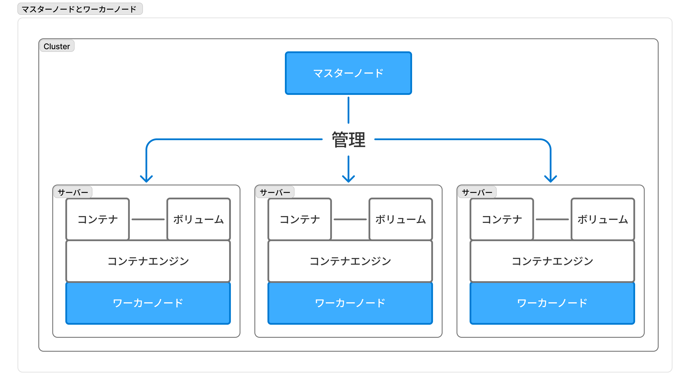
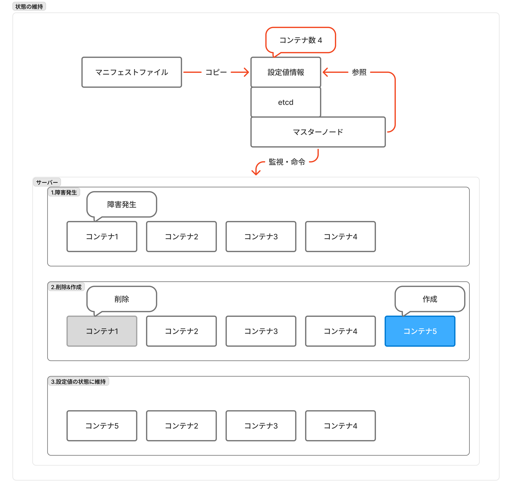

# Dockerゼミ #5 Docker&Kubernetesのきほんのきほん 8

## 目次

- [Dockerゼミ #5 Docker\&Kubernetesのきほんのきほん 8](#dockerゼミ-5-dockerkubernetesのきほんのきほん-8)
  - [目次](#目次)
  - [8章 - Kubernetesについて学ぼう](#8章---kubernetesについて学ぼう)
    - [8.1節　- Kubernetesとは](#81節--kubernetesとは)
    - [8.2節 - マスターノードとワーカーノード](#82節---マスターノードとワーカーノード)
      - [役割分担](#役割分担)
      - [マスターノード](#マスターノード)
      - [ワーカーノード](#ワーカーノード)
      - [インストールするアプリケーション](#インストールするアプリケーション)
      - [状態の維持](#状態の維持)
      - [ロードバランサー](#ロードバランサー)
  - [コメント・メモ](#コメントメモ)

---

## 8章 - Kubernetesについて学ぼう

### 8.1節　- Kubernetesとは

**Kubernetes(K8s)とは、コンテナのオーケストレーションツール**。
オーケストレーションツールとは、システム全体の統括をして複数コンテナを管理できるもの。

Kubernetesは大規模なシステムで特に有用。
Dockerは物理的（あるいは仮想的）な1台のマシン上で実行してきたが、Kubernetesでは物理的（あるいは仮想的）な複数台のマシンに対して命令・操作を行う。各マシン上に複数のコンテナがある。

つまり、**複数マシン上の大量のコンテナを「いい感じ」に作成・管理してくれるのがKubernetes**。
ここでいう「いい感じ」とは、マニフェストファイル（超大雑把にはdocker-compose.ymlのような定義ファイル）に従って自動でやってくれるという意味。

### 8.2節 - マスターノードとワーカーノード

#### 役割分担

Kubernetesには「マスターノード」と「ワーカーノード」という2種類のノード（物理的なマシンと思っておけば良い）が存在する。
この2つのノードで構成されたKubernetesシステムの一群を「Cluster」と呼ぶ。

- マスターノード：ワーカーノード（あるいはその上のコンテナ）を管理する
- ワーカーノード：実際の機能的なサーバー

#### マスターノード

マスターノードは、ワーカーノード（あるいはその上のコンテナ）を管理するためのもので、マスターノード上でコンテナは動いていない（そのためDocker Engineなどは必要ない）。

ワーカーノードを管理するための、マスターノードの「コントロールプレーン（制御盤）」は、以下の5つのコンポーネントで構成されている。

| 項目 | 内容 |
| --- | --- |
| `kube-apiserver` | 外部とやり取りをするプロセス。kubectlからの命令を受け取って実行。 |
| `kube-controller-manager` | コントローラーを統括管理・実行する |
| `kube-scheduler` | Podをワーカーノードに割り当てる |
| `cloud-controller-manager` | クラウドサービスと連携してサービスを作る |
| `etcd` | クラスター情報を全管理するデータベース |

#### ワーカーノード

ワーカーノードは、実際の機能的なサーバーとなるものであり、ワーカーノード上でコンテナを動かす（動かすコンテナはDockerとは限らない）。

ワーカーノードで使用されるコンポーネント（アプリケーション）は

| 項目 | 内容 |
| --- | --- |
| `kube-let` | マスターノード側の`kube-scheduler`と連携して、ワーカーノード上にPodを配置し実行する。実行中Podの状態を定期的に監視して`kube-scheduler`に通知する |
| `kube-proxy` | ネットワーク通信をルーティングする仕組み |

#### インストールするアプリケーション

Kubernetesはソフトウェアであるため、各マシンにインストールする必要がある。
各マシンとはノードのことであり、1つのマシンにKubernetesをインストールするとマスターノードとワーカーノードができるのではなく、複数のマシンにKubernetesをインストールし、マスターノードやワーカーノードをセットアップしてClusterを構成する。

※AI的には、1台のマシンをマスターノードとワーカーノードに分けることも可能。

インストールするべきソフトウェアの分類は

| ソフトウェア | 対象 | 概要 |
| --- | --- | --- |
| Kubernetes | マスターノード、ワーカーノード | Kubernetesのソフトウェア |
| CNI | マスターノード、ワーカーノード | Container Networking Interfaceの略で、仮想ネットワークのドライバ。flannel,Calico,AWS VPC CNIなど |
| etcd | マスターノード | キーバリュー型のデータベース |
| Container Engine | ワーカーノード | コンテナの実行に必要 |
| kubectl | 管理者（ユーザー）PCなど | コマンドによってkube-apiserverに対して命令を出せる |

※Kubernetesに複数のソフトウェアコンポーネント（kube-apiserverなど）が入っている。

#### 状態の維持

ここでは[8.1節](#81節--kubernetesとは)で述べた

> マシン上の大量のコンテナを「いい感じ」に作成・管理してくれる

について概要を説明する。
KubernetesのDocker（あるいはDocker Compsoe）との大きな違いの1つは、状態の維持である。
Docker Composeは複数コンテナを監視しておらず、まとめて作成して終了であるのに対し、**Kubernetes（というよりマスターノード）はコンテナを監視していて、設定内容と異なる状態になったとしたら自動で元の状態になるように維持**してくれる。

この維持するべき状態を示すのが、マニフェストファイルである。マニフェストファイルの内容が`etcd`に保存され、Kubernetesはそのデータベース上の情報を参照し、その状態に保つ。
※データベースに保存されているため、マニフェストファイルを変更せずにデータベースの値を変更すると、Kubernetesが参照する設定値とマニフェストファイルの内容に差分が生じるので注意

例えば、コンテナの数を4つで設定していた場合

1. 何らかの障害がそのうちの1つのコンテナで発生
2. Kubernetes（というよりマスターノード）が障害が発生したコンテナを削除 & 新たに同じコンテナを作成
3. コンテナ数を4に保つ

#### ロードバランサー

Q：同じコンテナが複数必要なの？？
A：大規模なシステムでは必要。全世界の人がアクセスするようなサービスでは、1つのサーバーではリクエストが多すぎて捌ききれない（サーバーダウンしてユーザーに謝罪する羽目に、、、）。
そのために同じサーバーを用意して、1つのサーバーあたりに来るリクエスト数を減らす。（他にも理由はあるが、、、）

↑ のような複数サーバーを扱う時には「ロードバランサー（負荷分散）」という単語が出てくる。

**ロードバランサーは、受け取る大量リクエストを複数のサーバーに振り分けるもの。**
イメージは、空いたレジに客を案内する人（この場合、サーバーはレジに対応）。

---

## コメント・メモ
