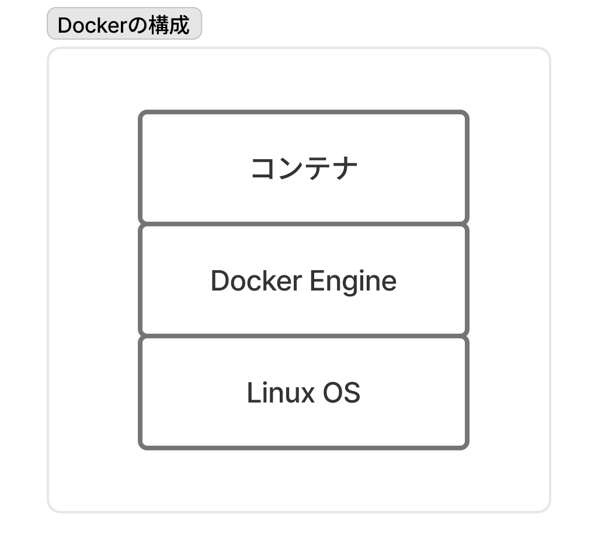
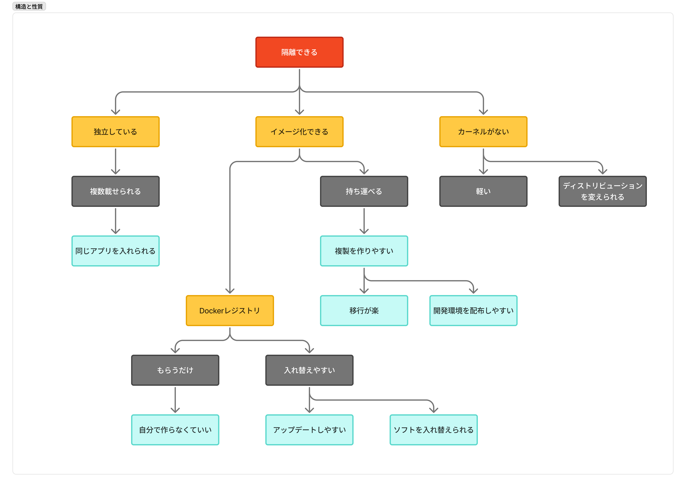
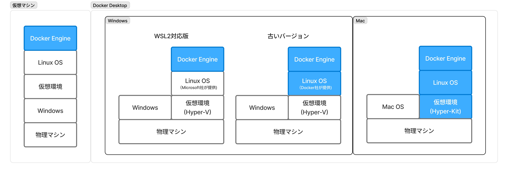

# Dockerゼミ #1 Docker&Kubernetesのきほんのきほん 1~3

## 目次

- [Dockerゼミ #1 Docker\&Kubernetesのきほんのきほん 1~3](#dockerゼミ-1-dockerkubernetesのきほんのきほん-13)
  - [目次](#目次)
  - [本の概要](#本の概要)
  - [1章 - Dockerとは何だろう](#1章---dockerとは何だろう)
    - [1.1節 - Dockerって何だろう](#11節---dockerって何だろう)
      - [Dockerの概要](#dockerの概要)
      - [隔離するメリット](#隔離するメリット)
    - [1.2節 - サーバとDocker](#12節---サーバとdocker)
      - [サーバーについて](#サーバーについて)
      - [ではDockerの利点は？](#ではdockerの利点は)
  - [2章 - Dockerが動く仕組み](#2章---dockerが動く仕組み)
    - [2.1節 - Dockerが動く仕組み](#21節---dockerが動く仕組み)
      - [Dockerの構成](#dockerの構成)
      - [OSとは](#osとは)
      - [LinuxOSっぽいものとは？Linux上でしか動かないとは？](#linuxosっぽいものとはlinux上でしか動かないとは)
    - [2.2節 - Docker Hubとイメージとコンテナ](#22節---docker-hubとイメージとコンテナ)
      - [イメージ](#イメージ)
      - [Docker Hub](#docker-hub)
      - [コンテナ](#コンテナ)
    - [2.3節 - Dockerコンテナのライフサイクルとデータの保存](#23節---dockerコンテナのライフサイクルとデータの保存)
      - [コンテナの運用](#コンテナの運用)
      - [データの保存](#データの保存)
    - [2.4節 - Dockerのメリットとデメリット](#24節---dockerのメリットとデメリット)
      - [Dockerたる所以とメリット](#dockerたる所以とメリット)
      - [デメリット](#デメリット)
  - [3章 - Dockerを使ってみよう](#3章---dockerを使ってみよう)
    - [3.1節 - Dockerを使うには](#31節---dockerを使うには)
      - [Windows用やmac用のDocker](#windows用やmac用のdocker)
      - [Dockerの使用要件](#dockerの使用要件)
    - [3.2節 - Dockerのインストール（スキップ）](#32節---dockerのインストールスキップ)
    - [3.3節 - Dockerの操作方法とコマンドプロンプト/ターミナルの起動（ほぼスキップ）](#33節---dockerの操作方法とコマンドプロンプトターミナルの起動ほぼスキップ)
      - [プロンプトとユーザー](#プロンプトとユーザー)
  - [4章 - Dockerにコンテナを入れて動かしてみよう](#4章---dockerにコンテナを入れて動かしてみよう)
    - [4.1節 - Docker Engineの起動と終了](#41節---docker-engineの起動と終了)
    - [4.2節 - コンテナ操作の基本](#42節---コンテナ操作の基本)
  - [コメント・メモ](#コメントメモ)
  - [ゼミについて](#ゼミについて)

---

## 本の概要

Dockerを知らない無学者向けの超入門書。Linuxやサーバー構築経験がなくても理解しやすいように1から説明している。Dockerという技術の概要を掴むのに良い本ではあるが、網羅的な知識が載っているわけではない。

基本的には、各節 知識 → ハンズオン の順で記述されていて非常にわかりやすい。

本で取り扱う範囲は

1. Dockerとは
2. Dockerの仕組み
3. Dockerを使うには
4. コンテナの動かし方
5. 複数コンテナの動かし方
6. 応用的なコンテナの使い方
7. Docker Compose
8. Kubernetes

---

## 1章 - Dockerとは何だろう

### 1.1節 - Dockerって何だろう

**Dockerとは「データやプログラムをそれぞれ独立した環境に隔離できる」仕組み**で、隔離する単位を「コンテナ」と呼ぶ。主にサーバーで使用される。

#### Dockerの概要

- Dockerはコンテナを使える仕組みで、Docker EngineというDockerのソフトウェアをインストールするとコンテナを操作できるようになる。
- コンテナ内にはApacheやMySQLなどのソフトウェアを入れる。
- コンテナは「イメージ」というコンテナの素から生成する。
- DockerはLinux OSが必要で、コンテナ内に入れるプログラムもLinux用のものである必要がある。



#### 隔離するメリット

端的に言えば、「競合を避けるため」。

システムA・Bで同じプログラムを使用していて、システムAがプログラムのver.5でのみ正常に作動し、システムBがプログラムのver.6でのみ正常に作動する場合がある。これは競合していて、どちらか一方しか正常に作動しない。
この時、システムとプログラムをまとめて1つのコンテナとして隔離すれば、システムAとver.5のプログラムのコンテナと、システムBとver.8のプログラムのコンテナの2つのコンテナで、プログラムを競合することなくシステムを動かすことができる。


### 1.2節 - サーバとDocker

#### サーバーについて

**サーバーとは「何かサービスを提供するもの」で**、開発現場においては

- 機能的な意味：webページを返したり、メールを返したりする。
- 物理的な意味：現物としてのコンピュータ。

の2通りで使用される。物理的な1つのサーバーに複数のサーバー機能を同居させることができる。
**サーバーがサーバーとしての機能を果たすためには、専用のソフトをインストールする必要がある**（Apacheをインストールすればwebサーバーになる）。

サーバー例

- webサーバー
  webサイトの機能を提供。Apache,Nginx,IISなど。
- データベースサーバー
  データを保存・検索するデータベースを置くサーバー。MySQL,PostgreSQL,MariaDBなど。
- DNSサーバー
  IPアドレスとドメインを結びつけるサーバー
- プロキシサーバー
  通信を中継するサーバー。社内LANなどからインターネット上のサーバーに接続する際に経由する。接続先（インターネット）から身元（ローカルPC）の情報を隠せる。
- 認証サーバー
  ユーザー認証のためのサーバー。OpenLDAPやActiveDirectoryなど。

サーバーとして使用されるOSは基本的にはLinuxである。
なぜなら、画面描画的な機能がサーバーには必要ないから。代表的なOSはUNIX系である。

- UNIX系
  - Linux系
    - Ubuntu,Debian
    - Red Hat,CentOS
  - BSD系
    - macOS
    - FreeBSD
  - Solaris系

#### ではDockerの利点は？

1. 競合を避ける
    「物理的な1つのサーバーに複数のサーバー機能を同居させることができる」が、物理的なサーバーあるいはOSを共有しているので、[1.1節](#11節---dockerって何だろう)で述べたような「競合」が問題となる可能性がある。
    **Dockerを使用すればこの問題を避け、1つの物理的なサーバーに複数のサーバー機能をコンテナとして「隔離」して同居させることができる。**
2. コンテナは持ち運べる
    イメージとして保存しておくことで、別の物理的なサーバーに同じ機能を移し替えることができる。（Dockerさえ使えればどんな物理的サーバーでも同じサーバー機能を実行できる）

---

## 2章 - Dockerが動く仕組み

### 2.1節 - Dockerが動く仕組み

#### Dockerの構成

Dockerを使用する際のサーバーマシン上の構成は以下のようになっている。


「なぜコンテナ内のOSはOSっぽいものなのか？」と「なぜサーバーマシンOSはLinuxOSのみ許されるのか？」に対して以下で答える。

#### OSとは

**OSとはソフトウェアの命令・プログラムをハードウェアに伝えるのも**であり、核となるカーネル（脳みそ）とディストリビューション（周辺部分）に分けられる。それぞれのおおまかな役割は

- カーネル
  - ハードウェアの操作
  - 計算
- ディストリビューション
  - ソフトウェアとカーネル間の命令・結果の伝達
  - ディスプレイへの表示
  - キーボード入力の受け取り

ディストリビューションはたとえば「Ubuntu」「CentOS」「Red Hat」「Alpine」「Debian」。

#### LinuxOSっぽいものとは？Linux上でしか動かないとは？

**DockerコンテナにあるLinuxOSっぽいものとは、Linuxのディストリビューション**のことで、カーネルは入っていない。
コンテナ内のLinuxディストリビューションは、コンテナ内で発行される命令をサーバーマシンOSのカーネルに伝える。つまり、**計算自体はサーバーマシンのカーネルが行っている**。

このことから**サーバーマシンがLinuxでなければ、コンテナ内のディストリビューションとサーバーマシンのカーネルが疎通できなくなり、Dockerコンテナは動かせない**。

つまり、「コンテナ内ディストリビューションがLinuxのものを使用」することと「計算自体はサーバーマシンのカーネルを使用」することから、DockerはLinuxOSの上でしか動かせなく、コンテナ内にはLinuxOSっぽいものが入っている。

ちなみにコンテナ内に入れるソフトウェアもLinux用のものでなければならない。
また、コンテナ内にカーネルごと入れないのは、コンテナを「軽く」するため。
また、Windowsやmac上でDockerを使っているときは、LinuxOSをどうにかして強引に入れている。


### 2.2節 - Docker Hubとイメージとコンテナ

#### イメージ

**（コンテナ）イメージとはコンテナ作成のための設計図**で、1つのイメージから同じコンテナを複数作ることができる。また、別のマシン上に同じコンテナを作成することもできる（コンテナは持ち運びできる、とよく言われるのはこのため）。

ちなみにコンテナからイメージを作ることもできる。つまりコンテナ上でカスタマイズして新しいイメージとすることができる。

#### Docker Hub

**Docker Hubとは、Dockerが公式的に運用しているDockerレジストリ。つまりDockerイメージの配布場所**であり、さまざまなイメージを自由にアップロード・ダウンロードできる。
社内サーバーにプライベートなイメージのレジストリを作成することもできる。

公開されているイメージの種類はおおまかに

- OSっぽいもののみ
- OSっぽいもの+ソフトウェア
- OSっぽいもの+複数のソフトウェア

であり、入っているもののバージョンによって別のイメージとなるため、組み合わせを考えれば膨大な数が公開されている。

※誰でもイメージを公開できるという性質上、危険なイメージも公開されているので注意が必要。とりあえず公式が出しているイメージのみ使用するのが吉。

#### コンテナ

1つのコンテナには複数のアプリケーションを入れることができる。
ただし一般的なコンテナの構成としては、**1コンテナ=1アプリ**である。
例えばWordPressを構築したければ、MySQLコンテナ・Apacheコンテナ・WordPressコンテナの3つにする。

このようにコンテナを分ける利点は

- セキュリティ面の向上
- 運用（メンテナンス）が容易

※複数アプリの入ったall in oneのコンテナは、ちょっと試しに使いたい時に使用するのが良い。

### 2.3節 - Dockerコンテナのライフサイクルとデータの保存

#### コンテナの運用

コンテナ運用の基本は**作って捨てる**であり、同じコンテナをずっと使い回すことはしない。アップデートがあれば新たなイメージから新たなコンテナを作成する。

このような「作る」「起動する」「停止する」「破棄する」というコンテナの一連の流れを**コンテナのライフサイクル**と呼ぶ。

#### データの保存

コンテナを破棄すると、コンテナ内で編集した内容などは消えてしまう。
このようなデータを保存したければ、物理的なマシン上にマウントして保存する。

**マウントとは、繋げて書き込めるようにした状態。**
PCにUSBメモリをつけてデータをそこに保存するのと同じように、コンテナに物理マシンのデータ領域を繋げることでコンテナ外部にデータを保存できる。

### 2.4節 - Dockerのメリットとデメリット



#### Dockerたる所以とメリット

**DockerのDockerたる所以は「隔離できる」こと**で、これによって

- コンテナ同士は独立している
- イメージ化が可能
- コンテナにカーネルが不要でディストリビューションを変更可能

Dockerのメリットは（上であげたものはメリットでもある）

- 1つの物理的なマシンに複数のサーバーを独立した状態で載せられる。
- 独立しているので運用・保守が容易
- サーバーの細かい知識なしでサーバー構築ができる（ほんとかよ？）

#### デメリット

Dockerのデメリットは

- Linux用ソフトウェアしか対応していない。（UNIXとかWindowsのOffice製品とか無理）
- 物理マシンの不具合に影響を受ける
- 複数コンテナを使うことが前提

---

## 3章 - Dockerを使ってみよう

### 3.1節 - Dockerを使うには

Dockerを使うにはLinuxが必要だが、Windowsやmacでも使える方法がある。Dockerを使う方法は3つあり

1. LinuxのマシンでDockerを使う
2. 仮想マシンやレンタル環境にDockerを入れて、他のOSで操作する
3. Windows用やmac用のDockerを使う

以下では最も手軽な3について説明する。

#### Windows用やmac用のDocker

いわゆる「Docker Desktop for Windows(Mac)」を利用するのが主流。純粋なDockerだけではなく、Linux OSの実行環境なども入っているパッケージ化されたもの。

このDocker DesktopでDockerを動かす仕組みは、**Windows(Mac)マシン上に仮想のLinux環境を作って、その上でDockerを動かしている**。Dockerを使用する時、ユーザーはLinux OSの存在は意識する必要がない。

マシン上ソフトウェアの描像は（青がDocker Desktopでパッケージ化されているもの）



WindowsにおいてはWSL2対応版が推奨されている。WSL2とは「Windows Subsystem for Linux 2」の略でWindows上でLinuxのソフトウェアを動かすための仕組み。このLinuxはMicrosoft社が提供するもので、DockerDesktopで入れるLinuxはDocker社が提供するもの。

#### Dockerの使用要件

Dockerを使用するために、Linux OSが必要という以外に細かい使用条件がある。

- Windows
  特に「64ビット　オペレーティングシステム、x64ベース　プロセッサ」は必要（多分もうこれが主流になっているのでほとんど気にしなくて良い）
  - 64bit版のOS
  - Hyper-VとContainersが有効
  - SLAT機能をサポートした64bitプロセッサ
  - 4GB以上のメモリ
  - BIOSでvirtualizationが有効
- Mac
  - 64bit版のOS
  - 2010年以降のモデル
  - 4GB以上のメモリ
- Linux
  - OSディストリビューションとバージョンが以下を満たす
    - CentOS: 7以降
    - Ubuntu（推奨）: 16.04以降
    - Debian: 9以降
    - Fedora: 30以降
  - Linuxカーネルが3.10以降
  - iptablesが1.4以降
  - Gitが1.7以降
  - XZ Utilsが4.9以降
  - procsとcgroups階層を取る

Linux OSのディストリビューションで**Ubuntuを推奨している理由は、Dockerで操作するコンテナで使用するLinux OSっぽいものと似ているから**。
ディストリビューションは`Red Hat`系（Cent OS, Fedoraなど）と`Debian`系（Debian, Ubuntuなど）の2つに分かれ、コマンドなどの細かい部分が異なる。コンテナ内で採用されるLinuxは`Debian`系のものが多いので、コンテナ内外で混乱しないためにはUbuntuが良い。

### 3.2節 - Dockerのインストール（スキップ）

### 3.3節 - Dockerの操作方法とコマンドプロンプト/ターミナルの起動（ほぼスキップ）

Dockerは基本的にCUI(Character User Interface)で操作する。Windowsでは「コマンドプロンプト」で、Macでは「Terminal」。
※Docker DesktopでGUI(Graphical User Interface)操作もでき非常に簡単だが、将来的にLinux上のDockerを触ることを考えてCUIに慣れておく必要あり。

#### プロンプトとユーザー

プロンプトはコマンドを打ち込む際に左側に表示されるもので、ユーザー情報が載っている。

- Windows
  
  ```prompt
  C:\Users\${username}>
  ```

- Mac
  
  ```terminal
  ${computername}: ~${username} $
  ```

- Linux
  
  ```linux
  [${username}@${hostname}~]#
  [${username}@${hostname}~]$
  ```

その他、知っておくべき事項は

- 実行したコマンドの終了後に次のプロンプトが表示される
- コマンドラインツールを終了してもDockerは終了しない

---

## 4章 - Dockerにコンテナを入れて動かしてみよう

### 4.1節 - Docker Engineの起動と終了

### 4.2節 - コンテナ操作の基本

---

## コメント・メモ

## ゼミについて

PR
